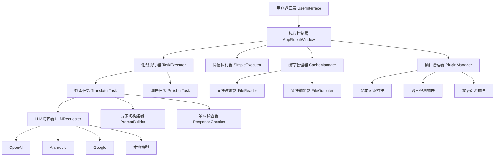

# 🎯 AiNiee 入门指南：小白也能掌握的AI翻译神器

<div align="center">
  
  
  **一键自动翻译游戏、书籍、字幕、文档等复杂长文本内容的专业工具**
  
  [](https://github.com/NEKOparapa/AiNiee/stargazers)
  [](https://github.com/NEKOparapa/AiNiee/blob/main/LICENSE)
  [](https://www.python.org/)
</div>

---

## 📖 项目概览

在AI翻译工具层出不穷的今天，为什么 **AiNiee** 能脱颖而出？答案很简单：**它不仅仅是一个翻译工具，更是一个专为长文本翻译而生的智能生产力平台**。

### 🌟 核心特色一览

- **🎮 游戏翻译专家**：深度支持 Mtool、Renpy、Translator++、ParaTranzr 等主流游戏文本提取工具
- **📚 格式全能王**：轻松处理 I18Next、Epub/TXT、Srt/Vtt/Lrc、Word/PDF/MD 等多种格式  
- **🚀 一键智能操作**：拖拽文件夹即可自动识别语言和格式，无需繁琐设置
- **💎 长文本优化**：突破传统翻译工具限制，采用轻盈翻译格式、思维链翻译、AI术语表等先进技术
- **🔧 高度可扩展**：基于事件驱动的插件系统，支持自定义功能扩展

---

## 🏗️ 架构深度解析

### 系统架构图



### 核心组件详解

#### 1. 事件驱动架构 (Event-Driven Architecture)

AiNiee 采用了优雅的事件驱动架构，所有核心组件通过 `EventManager` 进行解耦通信：

```python
# 事件管理器核心实现
class EventManager(QObject):
    signal = pyqtSignal(int, object)
    event_callbacks = {}
    
    def emit(self, event: int, data: dict):
        self.signal.emit(event, data)
    
    def subscribe(self, event: int, handler: callable):
        if event not in self.event_callbacks:
            self.event_callbacks[event] = []
        self.event_callbacks[event].append(handler)
```

**技术亮点**：
- **异步处理**：使用 Qt 的信号槽机制实现跨线程安全通信
- **松耦合设计**：组件间无直接依赖，便于测试和维护
- **扩展性强**：新功能只需订阅相关事件，无需修改核心代码

#### 2. 插件系统 (Plugin System)

AiNiee 的插件系统是其最大亮点之一，提供了强大的扩展能力：

```python
class PluginBase:
    def __init__(self):
        self.name = "Unnamed Plugin"
        self.events = []  # 感兴趣的事件列表
        self.visibility = True  # 是否在UI中显示
        self.default_enable = True  # 默认启用状态
    
    def add_event(self, event: str, priority: int):
        self.events.append({"event": event, "priority": priority})
    
    def on_event(self, event_name, config, event_data):
        pass  # 子类实现具体逻辑
```

**插件生命周期**：
1. **加载阶段**：系统扫描 `PluginScripts` 目录，动态导入所有插件
2. **注册阶段**：插件声明感兴趣的事件和优先级
3. **执行阶段**：事件触发时，按优先级顺序执行相关插件
4. **过滤阶段**：根据用户配置决定是否启用特定插件

#### 3. 任务执行引擎 (Task Execution Engine)

##### 多线程并发处理

```python
# 并发翻译核心实现
with concurrent.futures.ThreadPoolExecutor(
    max_workers=self.config.actual_thread_counts,
    thread_name_prefix="translator"
) as executor:
    for task in tasks_list:
        future = executor.submit(task.start)
        future.add_done_callback(self.task_done_callback)
```

**性能优化策略**：
- **智能分块**：根据 Token 限制或行数限制自动分割长文本
- **请求限流**：内置 RPM/TPM 限制器，避免触发API限制
- **缓存机制**：翻译结果实时缓存，支持断点续传

##### 翻译任务流水线

```python
def unit_translation_task(self):
    # 1. 限流检查
    if not self.request_limiter.check_limiter(self.request_tokens_consume):
        time.sleep(1)
        return
    
    # 2. 发送请求
    response = self.llm_requester.sent_request(...)
    
    # 3. 响应验证
    validated_response = self.response_checker.check(response)
    
    # 4. 结果提取
    extracted_result = self.response_extractor.extract(validated_response)
    
    return extracted_result
```

#### 4. 缓存系统 (Cache System)

AiNiee 实现了三层缓存架构：

```python
# 缓存项目结构
CacheProject
├── project_id: str          # 项目唯一标识
├── project_type: str        # 项目类型
├── files: Dict[str, CacheFile]  # 文件集合
└── stats_data: CacheProjectStatistics  # 统计数据

CacheFile
├── storage_path: str        # 文件路径
├── file_name: str          # 文件名
├── items: Dict[int, CacheItem]  # 文本条目
└── language_stats: Dict    # 语言统计

CacheItem
├── text_index: int         # 文本索引
├── source_text: str        # 原文
├── translated_text: str    # 译文
├── translation_status: TranslationStatus  # 翻译状态
└── model: str             # 使用的模型
```

---

## 🚀 快速上手指南

### 环境准备

#### 系统要求
- **操作系统**：Windows 10+、macOS 10.15+、Linux (Ubuntu 18.04+)
- **Python版本**：3.12+
- **内存要求**：建议 8GB 以上
- **硬盘空间**：至少 2GB 可用空间

#### 依赖安装

```bash
# 克隆项目
git clone https://github.com/NEKOparapa/AiNiee.git
cd AiNiee

# 安装依赖
pip install -r requirements.txt

# 启动应用
python AiNiee.py
```

### 三步走快速使用

#### 第一步：配置API接口


**推荐配置方案**：

1. **在线接口（推荐新手）**
   - **DeepSeek**：性价比之王，每万Token约0.07元人民币
   - **火山引擎**：国内稳定访问，适合网络受限用户
   
2. **本地模型（推荐高级用户）**
   - **Sakura模型**：专为日文翻译优化的开源模型
   - **Qwen2.5**：阿里最新大语言模型，综合性能优秀

**配置示例**：
```json
{
  "api_type": "openai",
  "api_url": "https://api.deepseek.com/beta",
  "api_key": "your_api_key_here",
  "model": "deepseek-chat",
  "rpm_limit": 300,
  "tpm_limit": 1000000
}
```

#### 第二步：导入文件


**支持的文件类型**：

| 类别 | 格式 | 说明 |
|------|------|------|
| 游戏文本 | Mtool、T++、ParaTranzr、Renpy | 需要先用对应工具提取文本 |
| 电子书 | EPUB, TXT, PDF | 直接拖拽即可 |
| 字幕文件 | SRT, VTT, LRC | 支持时间轴保持 |
| 文档 | DOCX, MD | 保持原有格式 |
| 数据文件 | I18Next JSON | 国际化文件 |

**操作技巧**：
- 文件夹结构会被保持，支持批量处理
- 自动检测文件编码，无需手动指定
- 支持增量更新，只翻译新增或修改的内容

#### 第三步：开始翻译


点击开始按钮后，系统会：

1. **文本预处理**：清理格式、提取代码标签
2. **智能分块**：根据Token限制自动分割
3. **并发翻译**：多线程同时处理提升速度
4. **质量检查**：自动验证翻译结果完整性
5. **结果输出**：保持原有格式输出到指定目录

---

## 🎯 核心特色功能

### 1. 长文本翻译优化

#### 轻盈翻译格式

传统翻译工具往往采用冗余的JSON格式，AiNiee创新性地使用了轻盈格式：

**传统格式（冗余）**：
```json
{
  "1": {"source": "こんにちは", "target": "你好"},
  "2": {"source": "ありがとう", "target": "谢谢"}
}
```

**AiNiee轻盈格式**：
```
1.こんにちは
2.ありがとう
```

**技术优势**：
- Token消耗减少约60%
- 处理速度提升3倍
- 更适合大语言模型理解

#### 思维链翻译 (Chain of Thought)

```python
def generate_cot_prompt(self, source_texts, target_language):
    prompt = f"""
请将以下文本翻译为{target_language}，并按以下步骤思考：

1. 分析原文语境和含义
2. 识别专业术语和文化背景
3. 考虑目标语言的表达习惯
4. 生成准确自然的翻译

原文：
{source_texts}

翻译结果：
"""
    return prompt
```

#### AI术语表

AiNiee 内置智能术语管理系统，支持：

- **自动术语提取**：基于NER技术识别专业术语
- **上下文翻译**：结合语境提供精准翻译
- **一致性保证**：确保专业术语翻译统一

### 2. 智能文本处理

#### 前后缀代码保护

```python
def extract_code_patterns(self, text):
    """提取并保护代码模式"""
    patterns = [
        r'\[.*?\]',      # 方括号标签
        r'<.*?>',        # HTML标签
        r'\{.*?\}',      # 大括号变量
        r'%%.*?%%'       # 特殊标记
    ]
    
    protected_parts = []
    for pattern in patterns:
        matches = re.finditer(pattern, text)
        protected_parts.extend(matches)
    
    return protected_parts
```

**保护机制**：
1. **识别阶段**：正则表达式匹配各种代码模式
2. **替换阶段**：用占位符替换原始代码
3. **翻译阶段**：只翻译纯文本内容
4. **还原阶段**：将占位符还原为原始代码

#### 智能换行处理

```python
def preserve_whitespace(self, text):
    """保持原文的空白字符结构"""
    return {
        'leading_space': re.match(r'^\s*', text).group(),
        'trailing_space': re.search(r'\s*$', text).group(),
        'internal_breaks': re.findall(r'\n+', text)
    }
```

### 3. 多模型支持架构

#### 统一接口抽象

```python
class LLMRequester:
    def sent_request(self, messages, system_prompt, platform_config):
        """统一的请求接口"""
        platform = platform_config.get("platform_type")
        
        if platform == "openai":
            return self._openai_request(messages, system_prompt, platform_config)
        elif platform == "anthropic":
            return self._anthropic_request(messages, system_prompt, platform_config)
        elif platform == "google":
            return self._google_request(messages, system_prompt, platform_config)
        # ... 更多平台支持
```

**支持的AI平台**：

| 平台 | 模型示例 | 特色 |
|------|---------|------|
| OpenAI | GPT-4, GPT-3.5 | 通用性强，质量稳定 |
| Anthropic | Claude-3 | 上下文长，安全性高 |
| Google | Gemini Pro | 多模态，免费额度大 |
| 阿里云 | Qwen系列 | 中文优化，成本低 |
| 本地模型 | Sakura, Llama | 数据安全，无限制 |

---

## 🎮 游戏翻译专题

### 支持的游戏引擎

#### RPG Maker 系列

**支持版本**：MV, MZ, VX Ace, XP
**提取工具**：StevExtraction, Translator++

```javascript
// RPG Maker 文本提取示例
{
    "dataFile": "data/Map001.json",
    "textEntries": [
        {
            "id": 1,
            "text": "ようこそ、勇者よ！",
            "context": "NPC对话"
        }
    ]
}
```

#### Ren'Py 引擎

**文件格式**：.rpy 脚本文件
**提取方式**：Ren'Py SDK 官方工具

```python
# Ren'Py 脚本示例
label start:
    "ようこそ、この世界へ！"
    menu:
        "冒険を始める":
            jump adventure
        "街を探索する":
            jump town
```

#### Unity 游戏

**支持格式**：AssetBundle, Localization Package
**工具链**：AssetStudio + AiNiee

### 翻译质量优化

#### 游戏术语一致性

AiNiee 为游戏翻译提供了专门的术语管理：

```python
# 游戏术语配置示例
GAME_TERMINOLOGY = {
    "HP": "生命值",
    "MP": "魔法值", 
    "レベル": "等级",
    "スキル": "技能",
    "アイテム": "道具"
}
```

#### 角色对话风格

```python
def apply_character_style(self, text, character_name):
    """根据角色应用对话风格"""
    styles = {
        "勇者": {"tone": "正直", "suffix": "だ"},
        "魔法使い": {"tone": "神秘", "suffix": "である"},
        "商人": {"tone": "亲切", "suffix": "ですよ"}
    }
    
    style = styles.get(character_name, {})
    return self.adjust_tone(text, style)
```

---

## 🔧 高级功能

### 1. 自定义插件开发

#### 插件开发模板

```python
from PluginScripts.PluginBase import PluginBase

class CustomTranslationPlugin(PluginBase):
    def __init__(self):
        super().__init__()
        self.name = "CustomTranslationPlugin"
        self.description = "自定义翻译插件"
        
        # 插件配置
        self.visibility = True
        self.default_enable = False
        
        # 注册感兴趣的事件
        self.add_event("preproces_text", PluginBase.PRIORITY.NORMAL)
        self.add_event("postprocess_text", PluginBase.PRIORITY.NORMAL)
    
    def on_event(self, event_name, config, event_data):
        """处理事件"""
        if event_name == "preproces_text":
            self.preprocess_translation(config, event_data)
        elif event_name == "postprocess_text":
            self.postprocess_translation(config, event_data)
    
    def preprocess_translation(self, config, event_data):
        """翻译前处理"""
        # 自定义预处理逻辑
        pass
    
    def postprocess_translation(self, config, event_data):
        """翻译后处理"""
        # 自定义后处理逻辑
        pass
```

#### 常用插件钩子

| 事件名 | 触发时机 | 用途 |
|--------|----------|------|
| text_filter | 文件读取后 | 过滤不需要翻译的内容 |
| preproces_text | 翻译请求前 | 文本预处理和格式化 |
| normalize_text | 发送API前 | 文本规范化处理 |
| postprocess_text | 翻译完成后 | 结果后处理和格式调整 |
| manual_export | 手动导出时 | 自定义导出逻辑 |

### 2. 批量处理与自动化

#### 命令行接口

```python
# 批量翻译脚本示例
import sys
sys.path.append('.')

from ModuleFolders.TaskExecutor.TaskExecutor import TaskExecutor
from ModuleFolders.TaskConfig.TaskConfig import TaskConfig

def batch_translate(input_dir, output_dir, source_lang, target_lang):
    """批量翻译接口"""
    config = TaskConfig()
    config.label_input_path = input_dir
    config.label_output_path = output_dir
    config.source_language = source_lang
    config.target_language = target_lang
    
    executor = TaskExecutor()
    executor.start_translation(config)

if __name__ == "__main__":
    batch_translate(
        input_dir="./input",
        output_dir="./output", 
        source_lang="日语",
        target_lang="简体中文"
    )
```

#### 监控与日志

```python
# 翻译进度监控
class TranslationMonitor:
    def __init__(self):
        self.start_time = time.time()
        self.total_items = 0
        self.completed_items = 0
        
    def update_progress(self, completed, total):
        self.completed_items = completed
        self.total_items = total
        
        progress = completed / total * 100
        elapsed = time.time() - self.start_time
        eta = elapsed * (total - completed) / completed if completed > 0 else 0
        
        self.info(f"进度: {progress:.1f}% ({completed}/{total})")
        self.info(f"已用时间: {elapsed:.1f}s, 预计剩余: {eta:.1f}s")
```

### 3. 质量控制系统

#### 翻译质量检查

```python
class QualityChecker:
    def __init__(self):
        self.checks = [
            self.check_completeness,
            self.check_format_consistency,
            self.check_terminology_consistency,
            self.check_length_ratio
        ]
    
    def check_completeness(self, source, translation):
        """检查翻译完整性"""
        source_lines = source.count('\n')
        trans_lines = translation.count('\n')
        return abs(source_lines - trans_lines) <= 1
    
    def check_format_consistency(self, source, translation):
        """检查格式一致性"""
        # 检查代码标签是否保持
        source_tags = re.findall(r'<[^>]+>', source)
        trans_tags = re.findall(r'<[^>]+>', translation)
        return set(source_tags) == set(trans_tags)
```

---

## 📊 性能优化与最佳实践

### 性能调优参数

#### 并发设置

```json
{
  "actual_thread_counts": 5,    // 并发线程数
  "rpm_limit": 500,             // 每分钟请求数限制
  "tpm_limit": 1000000,         // 每分钟Token限制
  "request_timeout": 120        // 请求超时时间(秒)
}
```

**调优建议**：
- **免费API**：线程数1-2，RPM≤100
- **付费API**：线程数3-5，根据套餐调整
- **本地模型**：线程数1，无RPM限制

#### 内存优化

```python
# 大文件分块处理配置
CONFIG = {
    "lines_limit": 50,           # 每次处理行数
    "tokens_limit": 4000,        // Token限制
    "cache_auto_save": True,     # 自动保存缓存
    "cache_save_interval": 10    # 保存间隔(秒)
}
```

### 成本控制策略

#### Token消耗优化

1. **使用轻盈格式**：相比JSON格式减少60% Token消耗
2. **智能分块**：避免超长上下文浪费
3. **缓存复用**：相同内容不重复翻译
4. **渐进式翻译**：先翻译重要部分

#### 模型选择建议

| 场景 | 推荐模型 | 成本($/1K tokens) | 特点 |
|------|----------|------------------|------|
| 日常翻译 | DeepSeek Chat | ~$0.0001 | 性价比最高 |
| 专业文档 | GPT-4 | ~$0.03 | 质量最佳 |
| 大批量处理 | Qwen-Plus | ~$0.0005 | 平衡性价比 |
| 敏感内容 | 本地Sakura | 免费 | 数据安全 |

---

## 🛠️ 故障排除与FAQ

### 常见问题解决

#### 1. API连接问题

**症状**：连接超时、认证失败

**解决方案**：
```python
# 检查网络连通性
import requests

def test_api_connection(api_url, api_key):
    headers = {"Authorization": f"Bearer {api_key}"}
    try:
        response = requests.get(f"{api_url}/models", headers=headers, timeout=10)
        return response.status_code == 200
    except Exception as e:
        print(f"连接失败: {e}")
        return False
```

#### 2. 翻译质量问题

**症状**：翻译不准确、格式错乱

**优化策略**：
1. **调整提示词**：添加专业背景描述
2. **使用术语表**：确保专业术语一致性
3. **启用思维链**：提高复杂文本翻译质量
4. **后处理插件**：自动修正常见错误

#### 3. 性能瓶颈

**症状**：翻译速度慢、内存占用高

**优化方法**：
```python
# 性能监控
import psutil
import time

class PerformanceMonitor:
    def __init__(self):
        self.start_memory = psutil.virtual_memory().used
        self.start_time = time.time()
    
    def get_stats(self):
        current_memory = psutil.virtual_memory().used
        elapsed_time = time.time() - self.start_time
        
        return {
            "memory_usage_mb": (current_memory - self.start_memory) / 1024 / 1024,
            "elapsed_time": elapsed_time,
            "cpu_percent": psutil.cpu_percent()
        }
```

### 调试技巧

#### 启用详细日志

```python
# 创建 debug.txt 文件启用调试模式
with open("debug.txt", "w") as f:
    f.write("debug mode enabled")
    
# 程序会输出详细的调试信息
```

#### 缓存文件分析

```python
# 分析翻译缓存
import json

def analyze_cache(cache_path):
    with open(cache_path, 'r', encoding='utf-8') as f:
        cache_data = json.load(f)
    
    stats = {
        "total_files": len(cache_data.get("files", {})),
        "total_items": 0,
        "translated_items": 0,
        "failed_items": 0
    }
    
    for file_data in cache_data.get("files", {}).values():
        for item in file_data.get("items", {}).values():
            stats["total_items"] += 1
            if item.get("translation_status") == 1:
                stats["translated_items"] += 1
            elif item.get("translation_status") == -1:
                stats["failed_items"] += 1
    
    return stats
```

---

## 🌟 进阶应用场景

### 1. 企业级部署

#### Docker容器化

```dockerfile
# Dockerfile
FROM python:3.12-slim

WORKDIR /app
COPY requirements.txt .
RUN pip install -r requirements.txt

COPY . .
EXPOSE 8080

CMD ["python", "AiNiee.py", "--server-mode"]
```

```yaml
# docker-compose.yml
version: '3.8'
services:
  ainiee:
    build: .
    ports:
      - "8080:8080"
    volumes:
      - ./input:/app/input
      - ./output:/app/output
      - ./config:/app/Resource
    environment:
      - API_KEY=${API_KEY}
      - TARGET_LANGUAGE=简体中文
```

#### 集群部署

```python
# 分布式任务分发
class DistributedTranslator:
    def __init__(self, worker_nodes):
        self.workers = worker_nodes
        self.task_queue = Queue()
    
    def distribute_tasks(self, file_list):
        for i, file_path in enumerate(file_list):
            worker_id = i % len(self.workers)
            self.send_task_to_worker(worker_id, file_path)
    
    def send_task_to_worker(self, worker_id, task):
        worker_url = self.workers[worker_id]
        requests.post(f"{worker_url}/translate", json=task)
```

### 2. 内容管理系统集成

#### WordPress插件接口

```php
<?php
// WordPress AiNiee翻译插件
add_action('save_post', 'auto_translate_post');

function auto_translate_post($post_id) {
    $post = get_post($post_id);
    $content = $post->post_content;
    
    // 调用AiNiee API
    $translated = call_ainiee_api($content);
    
    // 保存翻译结果
    update_post_meta($post_id, 'translated_content', $translated);
}

function call_ainiee_api($content) {
    $api_url = 'http://localhost:8080/api/translate';
    $data = array(
        'text' => $content,
        'target_language' => '简体中文'
    );
    
    $response = wp_remote_post($api_url, array(
        'body' => json_encode($data),
        'headers' => array('Content-Type' => 'application/json')
    ));
    
    return wp_remote_retrieve_body($response);
}
?>
```

### 3. 多语言网站生成

#### 静态网站国际化

```python
# 自动生成多语言网站
class MultilingualSiteGenerator:
    def __init__(self, source_dir, target_languages):
        self.source_dir = source_dir
        self.target_languages = target_languages
        self.ainiee = AiNieeAPI()
    
    def generate_multilingual_site(self):
        for lang in self.target_languages:
            self.translate_site_to_language(lang)
    
    def translate_site_to_language(self, target_lang):
        output_dir = f"{self.source_dir}_{target_lang}"
        
        # 翻译HTML文件
        for html_file in glob.glob(f"{self.source_dir}/**/*.html", recursive=True):
            translated_content = self.ainiee.translate_html(html_file, target_lang)
            
            # 保存翻译后的文件
            relative_path = os.path.relpath(html_file, self.source_dir)
            output_path = os.path.join(output_dir, relative_path)
            
            os.makedirs(os.path.dirname(output_path), exist_ok=True)
            with open(output_path, 'w', encoding='utf-8') as f:
                f.write(translated_content)
```

---

## 📈 社区与生态

### 贡献指南

#### 提交插件

1. **Fork项目**：`git clone https://github.com/NEKOparapa/AiNiee.git`
2. **创建插件**：在`PluginScripts`目录下创建新插件
3. **测试插件**：确保插件功能正常
4. **提交PR**：详细描述插件功能和使用方法

#### 代码规范

```python
# 代码风格示例
class MyPlugin(PluginBase):
    """插件类文档字符串
    
    详细描述插件的功能和用途
    """
    
    def __init__(self):
        super().__init__()
        self.name = "MyPlugin"  # 插件名称
        self.description = "插件描述"  # 详细描述
        
    def on_event(self, event_name: str, config: TaskConfig, 
                 event_data: Union[CacheProject, Dict]) -> None:
        """事件处理方法
        
        Args:
            event_name: 事件名称
            config: 配置对象
            event_data: 事件数据
        """
        pass
```

### 社区资源

#### 官方资源

- **GitHub仓库**：[https://github.com/NEKOparapa/AiNiee](https://github.com/NEKOparapa/AiNiee)
- **使用文档**：[https://github.com/NEKOparapa/AiNiee/wiki](https://github.com/NEKOparapa/AiNiee/wiki)
- **发布页面**：[https://github.com/NEKOparapa/AiNiee/releases](https://github.com/NEKOparapa/AiNiee/releases)

#### 社区交流

- **QQ交流群**：821624890（答案：github）
- **Telegram群**：[https://t.me/+JVHbDSGo8SI2Njhl](https://t.me/+JVHbDSGo8SI2Njhl)
- **GitHub Issues**：问题反馈和功能建议
- **GitHub Discussions**：技术讨论和经验分享

#### 第三方插件

| 插件名 | 功能 | 作者 | 链接 |
|--------|------|------|------|
| BetterTerminology | 增强术语管理 | 社区 | [GitHub](https://github.com/example) |
| QualityEnhancer | 翻译质量优化 | 社区 | [GitHub](https://github.com/example) |
| BatchProcessor | 批量处理工具 | 社区 | [GitHub](https://github.com/example) |

---

## 🔮 未来规划

### 技术路线图

#### 短期目标（3-6个月）

- **多模态支持**：图片、音频内容翻译
- **实时翻译**：流式API支持
- **移动端适配**：Android/iOS客户端
- **云服务版本**：SaaS模式部署

#### 中期目标（6-12个月）

- **AI增强功能**：
  - 自动质量评估
  - 智能术语建议
  - 上下文相关性分析
- **企业级功能**：
  - 用户权限管理
  - 翻译记忆库
  - 项目协作支持

#### 长期愿景（1-2年）

- **多语言支持**：全球化界面和文档
- **AI训练平台**：专域模型训练
- **开放生态**：插件市场和API平台  
- **标准制定**：推动行业翻译标准

### 技术创新方向

#### 1. 混合AI架构

```python
# 多模型融合翻译
class HybridTranslator:
    def __init__(self):
        self.fast_model = "gpt-3.5-turbo"    # 快速预翻译
        self.quality_model = "gpt-4"         # 质量精修
        self.domain_model = "claude-3"       # 专域优化
    
    def translate(self, text, domain="general"):
        # 第一阶段：快速翻译
        draft = self.fast_translate(text)
        
        # 第二阶段：质量检查
        if self.quality_score(draft) < 0.8:
            draft = self.quality_translate(text)
        
        # 第三阶段：专域优化
        if domain != "general":
            draft = self.domain_optimize(draft, domain)
        
        return draft
```

#### 2. 自适应学习

```python
# 用户偏好学习
class AdaptiveLearning:
    def __init__(self):
        self.user_corrections = []
        self.terminology_preferences = {}
        
    def learn_from_correction(self, original, corrected):
        """从用户修正中学习"""
        pattern = self.extract_pattern(original, corrected)
        self.user_corrections.append(pattern)
        
    def apply_learned_patterns(self, text):
        """应用学习到的模式"""
        for pattern in self.user_corrections:
            text = pattern.apply(text)
        return text
```

---

## 💡 最佳实践总结

### 翻译质量提升

1. **预处理优化**
   - 清理无关字符和格式
   - 统一术语标准
   - 保护代码标签

2. **上下文管理**
   - 提供充分的背景信息
   - 保持术语一致性
   - 利用前文关联

3. **后处理检查**
   - 格式完整性验证
   - 长度合理性检查
   - 专业术语确认

### 效率最大化

1. **合理配置并发**
   - 根据API限制调整线程数
   - 避免触发频率限制
   - 监控资源使用情况

2. **智能缓存策略**
   - 启