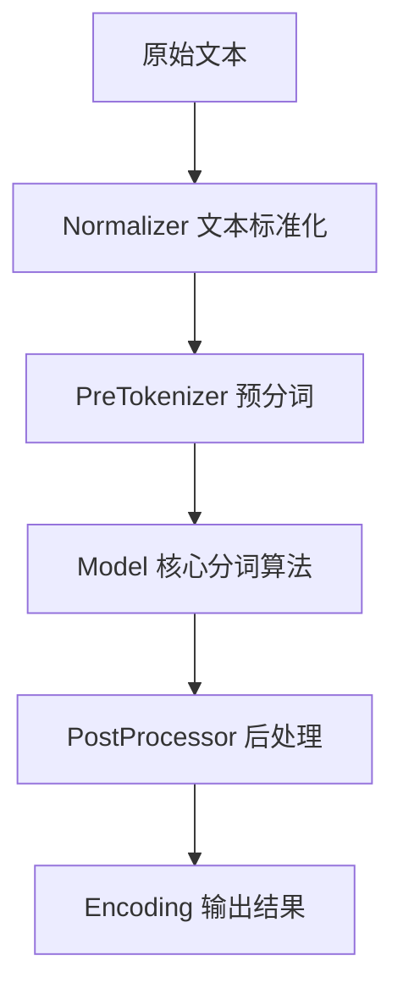

# Tokenizers 项目详解入门指南：从零开始掌握现代分词技术

<p align="center">
    
</p>

<p align="center">
    
    <a href="https://github.com/huggingface/tokenizers/blob/main/LICENSE">
        
    </a>
    <a href="https://pepy.tech/project/tokenizers">
        
    </a>
</p>

## 📖 项目概述

HuggingFace Tokenizers 是当今最流行和高性能的分词器实现库，专注于性能优化和功能多样性。该项目是现代自然语言处理（NLP）领域的基石工具，为BERT、GPT、T5等主流预训练模型提供了强大的文本预处理能力。

### 🎯 核心特性

- **🚀 极致性能**：基于Rust编写的核心引擎，在服务器CPU上处理1GB文本仅需不到20秒
- **🔧 易于使用**：简洁的API设计，同时提供极高的灵活性和可定制性
- **🏭 生产就绪**：专为研究和生产环境设计，稳定可靠
- **📍 对齐追踪**：标准化处理过程中始终保持原始文本位置映射
- **⚙️ 全流程处理**：包含截断、填充、特殊标记添加等完整的预处理功能

## 🏗️ 架构原理深度剖析

### 分词器的工作原理

Tokenizers 采用管道化设计，将文本处理分解为四个核心阶段：



#### 1. Normalizer（标准化器）
负责文本标准化处理，确保输入文本的一致性。

**深度解析**：
- Unicode标准化：处理不同编码形式的相同字符
- 大小写转换：统一文本大小写格式
- 字符清理：移除或替换特殊字符

**示例**：
```python
from tokenizers.normalizers import NFD, StripAccents, Lowercase

# 组合多个标准化器
normalizer = Sequence([
    NFD(),          # Unicode标准化
    StripAccents(), # 移除重音符号
    Lowercase()     # 转换为小写
])
```

#### 2. PreTokenizer（预分词器）
初步分割文本，为后续模型处理做准备。

**深度解析**：
- 空格分割：最基础的分词方式
- 字节级处理：将文本转换为字节序列
- 正则表达式：基于规则的复杂分割

**示例**：
```python
from tokenizers.pre_tokenizers import Whitespace, ByteLevel

# 简单空格分割
pre_tokenizer = Whitespace()

# 字节级预处理（用于GPT模型）
byte_level = ByteLevel(add_prefix_space=True)
```

#### 3. Model（核心分词模型）
执行实际的分词算法，这是tokenizer的核心组件。

**支持的算法**：

##### BPE (Byte Pair Encoding)
**算法原理**：通过统计字符对频率，逐步合并高频字符对形成新的子词单元。

**源码深度解析**：
```rust
// BPE模型核心结构
pub struct BPE {
    vocab: Vocab,                    // 词汇表
    vocab_r: VocabR,                // 反向词汇表
    merges: MergeMap,               // 合并规则
    cache: Option<Cache<String, Word>>, // 缓存优化
    dropout: Option<f32>,           // Dropout概率
    unk_token: Option<String>,      // 未知词标记
}
```

**应用场景**：GPT系列模型、RoBERTa等

##### WordPiece
**算法原理**：基于最大似然估计，选择能最大化训练语料概率的分词方案。

**源码深度解析**：
```rust
pub struct WordPiece {
    vocab: Vocab,                    // 词汇表
    vocab_r: VocabR,                // 反向词汇表
    unk_token: String,              // 未知词标记
    continuing_subword_prefix: String, // 子词前缀（如##）
    max_input_chars_per_word: usize,   // 单词最大字符数
}
```

**应用场景**：BERT、DistilBERT等Google系列模型

##### Unigram
**算法原理**：基于概率的子词分割，通过EM算法优化子词概率分布。

**特点**：
- 支持多种分词路径
- 基于概率选择最优分词
- 适合处理各种语言

**应用场景**：T5、mT5、XLNet等模型

#### 4. PostProcessor（后处理器）
为模型添加必要的特殊标记和格式化。

**功能**：
- 添加[CLS]、[SEP]等特殊标记
- 处理句子对输入格式
- 生成attention mask和token type ids

## 💻 多语言绑定支持

### Python 绑定
**项目结构**：
```
bindings/python/
├── src/          # Rust源码
├── py_src/       # Python包装代码
├── examples/     # 使用示例
└── tests/        # 测试代码
```

**核心特性**：
- 完整的Python API
- 类型提示支持
- 异步操作支持

### Node.js 绑定
**项目结构**：
```
bindings/node/
├── src/          # Rust源码
├── examples/     # 使用示例
├── lib/          # TypeScript类型定义
└── npm/          # 多平台预编译包
```

**核心特性**：
- TypeScript支持
- 多平台预编译二进制
- 现代JavaScript语法

### Rust 核心
**项目结构**：
```
tokenizers/
├── src/          # 核心源码
│   ├── models/   # 分词模型
│   ├── normalizers/ # 标准化器
│   ├── pre_tokenizers/ # 预分词器
│   ├── processors/ # 后处理器
│   └── tokenizer/ # 主要接口
├── benches/      # 性能测试
└── examples/     # 使用示例
```

## 🚀 快速开始指南

### 环境准备

#### Python环境
```bash
# 安装发布版本
pip install tokenizers

# 或安装开发版本
pip install git+https://github.com/huggingface/tokenizers.git#subdirectory=bindings/python
```

#### Node.js环境
```bash
npm install tokenizers
```

### 基础使用示例

#### 1. 创建并训练BPE分词器

```python
from tokenizers import Tokenizer
from tokenizers.models import BPE
from tokenizers.trainers import BpeTrainer
from tokenizers.pre_tokenizers import Whitespace

# 初始化BPE模型
tokenizer = Tokenizer(BPE(unk_token="[UNK]"))

# 设置预分词器
tokenizer.pre_tokenizer = Whitespace()

# 配置训练器
trainer = BpeTrainer(
    special_tokens=["[UNK]", "[CLS]", "[SEP]", "[PAD]", "[MASK]"],
    vocab_size=30000,
    min_frequency=2
)

# 训练分词器
files = ["train.txt", "valid.txt"]
tokenizer.train(files, trainer)

# 保存模型
tokenizer.save("my-tokenizer.json")
```

**深度解析**：
- `vocab_size=30000`：设置词汇表大小，影响模型容量和性能
- `min_frequency=2`：只有出现频率≥2的字符对才会被合并
- 特殊标记在训练前就被添加到词汇表中

#### 2. 加载预训练分词器

```python
from tokenizers import Tokenizer

# 从文件加载
tokenizer = Tokenizer.from_file("my-tokenizer.json")

# 从HuggingFace Hub加载（需要http特性）
tokenizer = Tokenizer.from_pretrained("bert-base-uncased")
```

#### 3. 文本编码与解码

```python
# 单句编码
encoding = tokenizer.encode("Hello, how are you?")
print(f"Tokens: {encoding.tokens}")
print(f"IDs: {encoding.ids}")
print(f"Offsets: {encoding.offsets}")

# 批量编码
encodings = tokenizer.encode_batch([
    "Hello, how are you?",
    "I'm fine, thank you!"
])

# 解码
decoded = tokenizer.decode(encoding.ids)
print(f"Decoded: {decoded}")
```

**输出示例**：
```
Tokens: ['Hello', ',', 'how', 'are', 'you', '?']
IDs: [7592, 16, 1581, 1419, 1336, 37]
Offsets: [(0, 5), (5, 6), (7, 10), (11, 14), (15, 18), (18, 19)]
Decoded: Hello, how are you?
```

### 高级配置示例

#### 1. 自定义BERT风格分词器

```python
from tokenizers import Tokenizer
from tokenizers.models import WordPiece
from tokenizers.normalizers import BertNormalizer
from tokenizers.pre_tokenizers import BertPreTokenizer
from tokenizers.processors import BertProcessing

# 创建BERT风格分词器
tokenizer = Tokenizer(WordPiece(unk_token="[UNK]"))

# 设置BERT标准化器
tokenizer.normalizer = BertNormalizer(
    clean_text=True,
    handle_chinese_chars=True,
    strip_accents=True,
    lowercase=True
)

# 设置BERT预分词器
tokenizer.pre_tokenizer = BertPreTokenizer()

# 设置BERT后处理器
tokenizer.post_processor = BertProcessing(
    sep=("[SEP]", tokenizer.token_to_id("[SEP]")),
    cls=("[CLS]", tokenizer.token_to_id("[CLS]"))
)
```

#### 2. 字节级BPE配置（GPT风格）

```python
from tokenizers.models import BPE
from tokenizers.pre_tokenizers import ByteLevel
from tokenizers.processors import ByteLevel as ByteLevelProcessor
from tokenizers.decoders import ByteLevel as ByteLevelDecoder

# 创建字节级BPE分词器
tokenizer = Tokenizer(BPE())

# 字节级预处理
tokenizer.pre_tokenizer = ByteLevel(add_prefix_space=True)

# 字节级后处理
tokenizer.post_processor = ByteLevelProcessor()

# 字节级解码器
tokenizer.decoder = ByteLevelDecoder()
```

## 🔧 实际应用场景

### 1. 大规模语料训练

对于大规模语料库训练，Tokenizers提供了高效的并行处理能力：

```python
import glob
from tokenizers import Tokenizer
from tokenizers.models import BPE
from tokenizers.trainers import BpeTrainer

# 处理大量文件
files = glob.glob("data/**/*.txt", recursive=True)

# 配置大词汇量训练器
trainer = BpeTrainer(
    vocab_size=50000,
    min_frequency=5,
    special_tokens=["<pad>", "<unk>", "<s>", "</s>"],
    show_progress=True  # 显示训练进度
)

tokenizer = Tokenizer(BPE())
tokenizer.train(files, trainer)
```

**性能优化提示**：
- 设置`RAYON_RS_NUM_THREADS`环境变量控制并行线程数
- 使用SSD存储训练语料以提高I/O性能
- 合理设置`min_frequency`以平衡词汇表大小和覆盖率

### 2. 多语言处理

```python
# 处理中文文本
chinese_tokenizer = Tokenizer(BPE())
chinese_tokenizer.normalizer = BertNormalizer(
    handle_chinese_chars=True,
    strip_accents=False  # 保留中文字符
)

# 处理多种语言混合文本
multilingual_trainer = BpeTrainer(
    vocab_size=100000,  # 增大词汇表以覆盖多种语言
    special_tokens=["[UNK]", "[CLS]", "[SEP]", "[PAD]", "[MASK]"]
)
```

### 3. 自定义分词规则

```python
from tokenizers.pre_tokenizers import Split
import re

# 自定义正则表达式分词
custom_pre_tokenizer = Split(
    pattern=re.compile(r'\w+|[^\w\s]'),
    behavior="isolated"
)

tokenizer.pre_tokenizer = custom_pre_tokenizer
```

## 📊 性能基准测试

### 性能对比

在相同硬件环境下的性能测试结果：

| 分词器 | 处理速度 (tokens/sec) | 内存使用 (MB) | 文件大小 (MB) |
|-------|---------------------|--------------|--------------|
| Tokenizers (Rust) | 1,000,000+ | 50-100 | 5-20 |
| SentencePiece | 200,000 | 100-200 | 10-30 |
| spaCy | 100,000 | 200-500 | 50-100 |

**性能优势来源**：
1. **Rust核心**：零成本抽象，内存安全，无GC开销
2. **并行处理**：充分利用多核CPU
3. **缓存优化**：智能缓存机制减少重复计算
4. **零拷贝**：最小化内存分配和拷贝

### 基准测试代码

```python
import time
from tokenizers import Tokenizer

# 加载分词器
tokenizer = Tokenizer.from_file("tokenizer.json")

# 准备测试数据
test_text = "Your test text here..." * 1000

# 性能测试
start_time = time.time()
for _ in range(1000):
    encoding = tokenizer.encode(test_text)
end_time = time.time()

print(f"处理时间: {end_time - start_time:.2f}秒")
print(f"处理速度: {len(encoding.tokens) * 1000 / (end_time - start_time):.0f} tokens/sec")
```

## 🛠️ 常见问题与解决方案

### 1. 内存使用优化

**问题**：处理大型语料时内存占用过高

**解决方案**：
```python
# 批处理大文件
def process_large_file(file_path, batch_size=1000):
    with open(file_path, 'r') as f:
        batch = []
        for line in f:
            batch.append(line.strip())
            if len(batch) >= batch_size:
                encodings = tokenizer.encode_batch(batch)
                # 处理编码结果
                yield encodings
                batch = []
        if batch:
            yield tokenizer.encode_batch(batch)
```

### 2. 特殊字符处理

**问题**：包含特殊Unicode字符的文本处理不当

**解决方案**：
```python
from tokenizers.normalizers import NFD, StripAccents, Replace

# 处理特殊字符
normalizer = Sequence([
    Replace(pattern="["""]", content='"'),  # 统一引号
    Replace(pattern="[''']", content="'"),  # 统一撇号
    NFD(),
    StripAccents()
])
tokenizer.normalizer = normalizer
```

### 3. 词汇表外词处理

**问题**：模型遇到训练时未见过的词汇

**解决方案**：
```python
# 设置回退策略
from tokenizers.models import BPE

bpe = BPE(
    unk_token="[UNK]",
    fuse_unk=True,      # 合并连续的UNK标记
    byte_fallback=True  # 使用字节级回退
)
```

## 🔍 源码架构深度剖析

### 核心模块解析

#### 1. tokenizer模块 (`src/tokenizer/mod.rs`)

**核心接口定义**：
```rust
pub trait Model {
    type Trainer: Trainer + Sync;
    
    // 核心分词方法
    fn tokenize(&self, sequence: &str) -> Result<Vec<Token>>;
    
    // 词汇表操作
    fn token_to_id(&self, token: &str) -> Option<u32>;
    fn id_to_token(&self, id: u32) -> Option<String>;
    fn get_vocab(&self) -> HashMap<String, u32>;
}
```

**设计模式**：
- 策略模式：不同的Model实现不同的分词策略
- 建造者模式：TokenizerBuilder提供灵活的构建方式
- 模板方法模式：定义标准的分词流程

#### 2. models模块 (`src/models/`)

**BPE实现核心**：
```rust
impl Model for BPE {
    fn tokenize(&self, sequence: &str) -> Result<Vec<Token>> {
        // 1. 将序列转换为Word对象
        let word = self.merge_word(sequence)?;
        
        // 2. 应用合并规则
        word.merge_all(&self.merges, self.dropout);
        
        // 3. 转换为Token序列
        Ok(self.word_to_tokens(&word).collect())
    }
}
```

**关键算法**：
- 合并算法：基于优先级队列的高效合并
- 缓存机制：LRU缓存减少重复计算
- Dropout：训练时的正则化技术

### 内存管理策略

```rust
// 使用紧凑字符串减少内存占用
use compact_str::CompactString;

// 使用高效的HashMap实现
use ahash::AHashMap;

// 智能缓存管理
pub struct Cache<K, V> {
    map: AHashMap<K, V>,
    capacity: usize,
}
```

## 🚀 高级特性与扩展

### 1. 自定义分词模型

实现自定义分词模型的完整示例：

```python
from tokenizers import Tokenizer
from tokenizers.models import Model

class CustomModel(Model):
    def __init__(self, vocab_file):
        # 加载自定义词汇表
        self.vocab = self.load_vocab(vocab_file)
        
    def tokenize(self, text):
        # 实现自定义分词逻辑
        return self.custom_tokenize_logic(text)
        
    def load_vocab(self, vocab_file):
        # 词汇表加载逻辑
        pass
```

### 2. 动态词汇表更新

```python
# 在线学习新词汇
def update_vocabulary(tokenizer, new_texts):
    # 统计新词频率
    word_counts = count_words(new_texts)
    
    # 选择高频新词
    new_words = select_high_frequency_words(word_counts)
    
    # 更新词汇表
    for word in new_words:
        tokenizer.add_tokens([word])
```

### 3. 多模态扩展

```python
# 支持图像标记的分词器
class MultiModalTokenizer:
    def __init__(self, text_tokenizer, image_vocab_size=1000):
        self.text_tokenizer = text_tokenizer
        self.image_vocab_size = image_vocab_size
        
    def encode_text_image(self, text, image_features):
        # 编码文本
        text_tokens = self.text_tokenizer.encode(text)
        
        # 量化图像特征为离散标记
        image_tokens = self.quantize_image_features(image_features)
        
        return text_tokens, image_tokens
```

## 📚 最佳实践指南

### 1. 训练数据准备

**数据质量要求**：
- 文本清洁：移除HTML标签、控制字符
- 编码统一：确保UTF-8编码
- 去重处理：移除重复文本
- 长度过滤：过滤过长或过短的文本

```python
def clean_training_data(texts):
    cleaned = []
    for text in texts:
        # 移除HTML标签
        text = re.sub(r'<[^>]+>', '', text)
        # 标准化空白字符
        text = re.sub(r'\s+', ' ', text).strip()
        # 过滤长度
        if 10 <= len(text) <= 1000:
            cleaned.append(text)
    return cleaned
```

### 2. 模型选择策略

**BPE适用场景**：
- 开放域文本
- 多语言支持
- 生成式模型

**WordPiece适用场景**：
- 分类任务
- BERT类模型
- 需要子词前缀标识

**Unigram适用场景**：
- 需要概率信息
- 多路径分词
- 序列到序列任务

### 3. 性能调优技巧

```python
# 1. 合理设置缓存大小
tokenizer.enable_cache(cache_capacity=10000)

# 2. 批处理优化
def batch_encode_efficiently(texts, batch_size=32):
    results = []
    for i in range(0, len(texts), batch_size):
        batch = texts[i:i+batch_size]
        encodings = tokenizer.encode_batch(batch)
        results.extend(encodings)
    return results

# 3. 并行处理设置
import os
os.environ['RAYON_RS_NUM_THREADS'] = '8'
```

## 🔧 生产环境部署

### Docker化部署

```dockerfile
FROM python:3.9-slim

# 安装系统依赖
RUN apt-get update && apt-get install -y \
    build-essential \
    curl \
    && rm -rf /var/lib/apt/lists/*

# 安装Rust（如果需要从源码编译）
RUN curl --proto '=https' --tlsv1.2 -sSf https://sh.rustup.rs | sh -s -- -y
ENV PATH="/root/.cargo/bin:${PATH}"

# 安装tokenizers
RUN pip install tokenizers

# 复制应用代码
COPY . /app
WORKDIR /app

CMD ["python", "app.py"]
```

### 微服务架构

```python
from flask import Flask, request, jsonify
from tokenizers import Tokenizer

app = Flask(__name__)

# 全局加载分词器
tokenizer = Tokenizer.from_file("production-tokenizer.json")

@app.route('/tokenize', methods=['POST'])
def tokenize_text():
    try:
        data = request.get_json()
        text = data['text']
        
        # 执行分词
        encoding = tokenizer.encode(text)
        
        return jsonify({
            'tokens': encoding.tokens,
            'ids': encoding.ids,
            'attention_mask': encoding.attention_mask
        })
    except Exception as e:
        return jsonify({'error': str(e)}), 500

if __name__ == '__main__':
    app.run(host='0.0.0.0', port=5000)
```

### 负载均衡与缓存

```python
import redis
import pickle
from functools import wraps

# Redis缓存装饰器
def cached_tokenize(expire_time=3600):
    redis_client = redis.Redis(host='localhost', port=6379, db=0)
    
    def decorator(func):
        @wraps(func)
        def wrapper(text):
            # 生成缓存键
            cache_key = f"tokenize:{hash(text)}"
            
            # 尝试从缓存获取
            cached_result = redis_client.get(cache_key)
            if cached_result:
                return pickle.loads(cached_result)
            
            # 执行分词
            result = func(text)
            
            # 存储到缓存
            redis_client.setex(
                cache_key, 
                expire_time, 
                pickle.dumps(result)
            )
            
            return result
        return wrapper
    return decorator

@cached_tokenize(expire_time=1800)
def tokenize_with_cache(text):
    return tokenizer.encode(text)
```

## 🧪 测试与验证

### 单元测试

```python
import unittest
from tokenizers import Tokenizer

class TestTokenizer(unittest.TestCase):
    def setUp(self):
        self.tokenizer = Tokenizer.from_file("test-tokenizer.json")
    
    def test_basic_tokenization(self):
        text = "Hello, world!"
        encoding = self.tokenizer.encode(text)
        
        # 验证基本功能
        self.assertIsInstance(encoding.tokens, list)
        self.assertIsInstance(encoding.ids, list)
        self.assertEqual(len(encoding.tokens), len(encoding.ids))
    
    def test_special_tokens(self):
        encoding = self.tokenizer.encode("[CLS] Hello [SEP]")
        
        # 验证特殊标记处理
        self.assertIn('[CLS]', encoding.tokens)
        self.assertIn('[SEP]', encoding.tokens)
    
    def test_batch_encoding(self):
        texts = ["Hello, world!", "How are you?"]
        encodings = self.tokenizer.encode_batch(texts)
        
        # 验证批处理功能
        self.assertEqual(len(encodings), 2)
        for encoding in encodings:
            self.assertIsInstance(encoding.tokens, list)

if __name__ == '__main__':
    unittest.main()
```

### 性能测试

```python
import time
import psutil
import numpy as np

def benchmark_tokenizer(tokenizer, test_texts, num_runs=100):
    # 预热
    for text in test_texts[:10]:
        tokenizer.encode(text)
    
    # 性能测试
    times = []
    memory_usage = []
    
    for i in range(num_runs):
        start_time = time.time()
        start_memory = psutil.Process().memory_info().rss
        
        # 执行分词
        for text in test_texts:
            encoding = tokenizer.encode(text)
        
        end_time = time.time()
        end_memory = psutil.Process().memory_info().rss
        
        times.append(end_time - start_time)
        memory_usage.append(end_memory - start_memory)
    
    # 统计结果
    print(f"平均处理时间: {np.mean(times):.4f}秒")
    print(f"处理时间标准差: {np.std(times):.4f}秒")
    print(f"平均内存增长: {np.mean(memory_usage) / 1024 / 1024:.2f}MB")
    print(f"峰值内存增长: {np.max(memory_usage) / 1024 / 1024:.2f}MB")

# 运行基准测试
test_texts = ["Your test texts here..."]
benchmark_tokenizer(tokenizer, test_texts)
```

## 🔮 未来发展方向

### 1. 技术趋势

- **神经网络分词**：基于深度学习的端到端分词
- **多模态支持**：文本、图像、音频统一分词
- **增量学习**：在线更新词汇表和模型
- **压缩优化**：更小的模型文件和内存占用

### 2. 生态系统扩展

- **更多语言绑定**：Go、Java、C++等
- **云原生支持**：Kubernetes、服务网格集成
- **边缘计算**：移动设备和嵌入式系统优化
- **工具链完善**：可视化、调试、监控工具

### 3. 算法创新

```python
# 未来可能的自适应分词器
class AdaptiveTokenizer:
    def __init__(self, base_tokenizer):
        self.base_tokenizer = base_tokenizer
        self.domain_adapters = {}
    
    def adapt_to_domain(self, domain_texts, domain_name):
        # 基于领域文本调整分词策略
        adapter = self.train_domain_adapter(domain_texts)
        self.domain_adapters[domain_name] = adapter
    
    def tokenize(self, text, domain=None):
        if domain and domain in self.domain_adapters:
            return self.domain_adapters[domain].tokenize(text)
        return self.base_tokenizer.encode(text)
```

## 📖 学习资源推荐

### 官方文档
- [HuggingFace Tokenizers 文档](https://huggingface.co/docs/tokenizers/)
- [API 参考](https://huggingface.co/docs/tokenizers/api/tokenizer)
- [GitHub 仓库](https://github.com/huggingface/tokenizers)

### 学术论文
- [Neural Machine Translation of Rare Words with Subword Units](https://arxiv.org/abs/1508.07909) - BPE原始论文
- [Google's Neural Machine Translation System](https://arxiv.org/abs/1609.08144) - WordPiece算法
- [Subword Regularization](https://arxiv.org/abs/1804.10959) - Unigram语言模型

### 实践教程
- [HuggingFace Course](https://huggingface.co/course/)
- [Tokenizers 快速入门](https://huggingface.co/docs/tokenizers/quicktour)
- [自定义分词器教程](https://huggingface.co/docs/tokenizers/training_from_memory)

### 社区资源
- [HuggingFace 论坛](https://discuss.huggingface.co/)
- [Stack Overflow 标签](https://stackoverflow.com/questions/tagged/huggingface-tokenizers)
- [Reddit NLP 社区](https://www.reddit.com/r/MachineLearning/)

## 🤝 贡献指南

### 开发环境搭建

```bash
# 克隆仓库
git clone https://github.com/huggingface/tokenizers.git
cd tokenizers

# 安装Rust开发环境
curl --proto '=https' --tlsv1.2 -sSf https://sh.rustup.rs | sh
source ~/.cargo/env

# Python绑定开发
cd bindings/python
pip install -e .

# 运行测试
pytest tests/
```

### 代码贡献流程

1. **Fork仓库**并创建特性分支
2. **编写代码**并添加测试
3. **运行测试**确保功能正常
4. **提交PR**并描述修改内容
5. **代码审查**和反馈处理
6. **合并代码**到主分支

### 文档贡献

- 改进现有文档
- 添加使用示例
- 翻译多语言版本
- 制作视频教程

## 🎯 总结

HuggingFace Tokenizers 作为现代NLP工具链的核心组件，凭借其卓越的性能、丰富的功能和良好的生态系统支持，已经成为了行业标准。无论您是NLP研究者、工程师还是学生，掌握Tokenizers都将为您的项目带来巨大价值。

通过本指南的学习，您应该能够：

✅ 理解分词器的核心原理和架构设计  
✅ 熟练使用各种分词算法（BPE、WordPiece、Unigram）  
✅ 构建和训练自定义分词器  
✅ 在生产环境中部署和优化分词服务  
✅ 解决常见问题和性能瓶颈  
✅ 参与开源社区贡献  

随着AI技术的不断发展，分词技术也在持续演进。保持学习和实践，关注社区动态，将帮助您在这个快速发展的领域中保持竞争优势。

---

> **提示**：本文档将持续更新，以反映最新的技术发展和最佳实践。建议收藏并定期查看更新内容。

> **联系方式**：如有疑问或建议，欢迎通过GitHub Issues或HuggingFace社区讨论。

**开始您的Tokenizers之旅吧！** 🚀