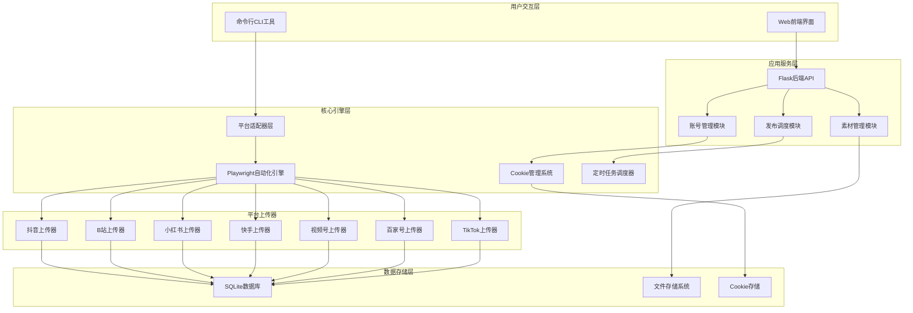

# Social-Auto-Upload 完整入门指南

## 📋 目录

- [项目概览](#项目概览)
- [系统架构](#系统架构)
- [安装部署](#安装部署)
- [核心功能详解](#核心功能详解)
- [使用场景与实践](#使用场景与实践)
- [开发者指南](#开发者指南)
- [故障排查](#故障排查)
- [性能优化](#性能优化)

---

## 🌟 项目概览

`social-auto-upload` 是一个功能强大的多平台社交媒体视频自动化上传工具，专为内容创作者和运营团队打造。它支持国内外主流平台的视频发布，包括抖音、Bilibili、小红书、快手、视频号、百家号和TikTok等，实现了真正的"一键多发"功能。

### 核心价值

- **效率提升**: 一次配置，多平台同步发布，节省90%的重复工作时间
- **智能调度**: 支持定时发布和批量上传，满足专业运营需求  
- **技术先进**: 基于Playwright自动化框架，模拟真实用户操作
- **架构灵活**: 前后端分离设计，支持CLI和Web界面双模式

### 支持平台

#### 国内平台
- ✅ **抖音** - 短视频领域龙头，日活超6亿
- ✅ **Bilibili** - 中国最大的视频弹幕网站
- ✅ **小红书** - 生活方式社区，年轻用户聚集地
- ✅ **快手** - 短视频和直播平台
- ✅ **视频号** - 微信生态内的短视频平台
- ✅ **百家号** - 百度内容生态平台

#### 国外平台
- ✅ **TikTok** - 全球短视频平台领导者
- 🔄 **YouTube** - 开发中

---

## 🏗️ 系统架构

### 整体架构图



### 技术架构详解

#### 前端技术栈
- **Vue 3**: 采用Composition API，提供响应式的现代化开发体验
- **Element Plus**: 企业级UI组件库，保证界面一致性和用户体验
- **Vite**: 极速构建工具，支持热重载和模块化开发
- **Pinia**: Vue 3官方状态管理库，替代Vuex提供更好的TypeScript支持
- **Axios**: HTTP客户端，统一封装API请求

#### 后端技术栈  
- **Flask**: 轻量级Python Web框架，快速构建RESTful API
- **SQLite**: 嵌入式数据库，零配置部署，适合中小型应用
- **Playwright**: 微软开源的浏览器自动化框架，支持多浏览器
- **AsyncIO**: Python异步编程，提高并发处理能力

### 项目目录结构

```
social-auto-upload/
├── cli_main.py                 # 命令行入口
├── sau_backend.py              # Web后端服务
├── conf.example.py             # 配置文件模板
├── uploader/                   # 平台上传器
│   ├── douyin_uploader/        # 抖音上传器
│   │   └── main.py            
│   ├── bilibili_uploader/      # B站上传器
│   ├── xiaohongshu_uploader/   # 小红书上传器
│   ├── ks_uploader/            # 快手上传器
│   ├── tencent_uploader/       # 视频号上传器
│   ├── tk_uploader/            # TikTok上传器
│   └── baijiahao_uploader/     # 百家号上传器
├── sau_frontend/               # Vue3前端项目
│   ├── src/
│   │   ├── views/             # 页面组件
│   │   ├── components/        # 公共组件
│   │   ├── api/              # API接口
│   │   ├── stores/           # 状态管理
│   │   └── router/           # 路由配置
│   ├── package.json
│   └── vite.config.js
├── utils/                      # 工具模块
│   ├── base_social_media.py   # 基础平台类
│   ├── constant.py            # 常量定义
│   ├── files_times.py         # 文件时间处理
│   ├── log.py                 # 日志系统
│   └── network.py             # 网络工具
├── examples/                   # 使用示例
│   ├── upload_video_to_douyin.py
│   ├── upload_video_to_bilibili.py
│   └── ...
├── myUtils/                    # 业务工具
│   ├── auth.py                # 认证模块
│   ├── login.py               # 登录处理
│   └── postVideo.py           # 视频发布
├── db/                         # 数据库
│   └── createTable.py         # 数据表创建
├── videos/                     # 视频存储目录
└── cookies/                    # Cookie存储目录
```

### 目录结构解析

#### 核心模块
- **uploader/**: 各平台上传器实现，每个平台独立目录
- **utils/**: 通用工具模块，包含基础类和常用函数
- **sau_backend.py**: Flask后端主服务，提供RESTful API
- **cli_main.py**: 命令行工具入口，支持脚本化调用

#### 前端项目 
- **sau_frontend/**: 基于Vue3的Web管理界面
- **examples/**: 平台使用示例脚本，新手学习首选

#### 数据目录
- **videos/**: 视频文件存储目录
- **cookies/**: 各平台登录凭证存储
- **db/**: SQLite数据库文件

---

## 🚀 安装部署

### 环境要求

- **Python**: 3.8+ (推荐3.10)
- **Node.js**: 16+ (仅前端开发需要)
- **操作系统**: Windows/macOS/Linux
- **浏览器**: Chrome/Chromium (必需)

### 快速安装

#### 1. 克隆项目
```bash
git clone https://github.com/dreammis/social-auto-upload.git
cd social-auto-upload
```

#### 2. Python环境配置

**使用Conda (推荐)**:
```bash
# 创建虚拟环境
conda create -n social-auto-upload python=3.10
conda activate social-auto-upload

# 安装依赖
pip install -r requirements.txt
```

**使用venv**:
```bash
# 创建虚拟环境
python -m venv venv

# 激活环境 (Windows)
venv\Scripts\activate
# 激活环境 (macOS/Linux)
source venv/bin/activate

# 安装依赖
pip install -r requirements.txt
```

#### 3. 浏览器驱动安装
```bash
# 安装Playwright浏览器
playwright install chromium

# 可选: 安装Firefox (TikTok旧版本需要)
playwright install firefox
```

#### 4. 配置文件设置

复制配置模板：
```bash
cp conf.example.py conf.py
```

编辑 `conf.py` 文件，配置关键参数：

```python
# 基础路径配置
BASE_DIR = Path(__file__).resolve().parent

# Chrome浏览器路径 (根据实际安装路径修改)
LOCAL_CHROME_PATH = r"C:\Program Files\Google\Chrome\Application\chrome.exe"  # Windows
# LOCAL_CHROME_PATH = "/Applications/Google Chrome.app/Contents/MacOS/Google Chrome"  # macOS

# 抖音发布配置
DOUYIN_PUBLISH_MODE = "immediate"  # immediate: 立即发布, scheduled: 定时发布
DOUYIN_SCHEDULE_TIMES = ["09:30", "12:00", "18:30"]  # 定时发布时间点
DOUYIN_VIDEOS_PER_DAY = 3  # 每天发布视频数量
```

#### 5. 数据库初始化
```bash
cd db
python createTable.py
cd ..
```

#### 6. 创建必要目录
```bash
# 创建视频和Cookie存储目录
mkdir -p videoFile cookiesFile videos cookies
```

#### 7. 启动服务

**后端服务**:
```bash
python sau_backend.py
# 访问: http://localhost:5409
```

**前端开发服务**:
```bash
cd sau_frontend
npm install
npm run dev
# 访问: http://localhost:5173
```

### 验证安装

运行以下命令测试环境：

```bash
# 测试CLI工具
python cli_main.py --help

# 测试后端API
curl http://localhost:5409/getValidAccounts
```

---

## 💡 核心功能详解

### 1. 账号管理系统

#### Cookie认证机制
项目采用Cookie方式管理平台登录状态，避免频繁输入账号密码：

```python
# Cookie验证流程
async def cookie_auth(account_file):
    async with async_playwright() as playwright:
        browser = await playwright.chromium.launch(headless=True)
        context = await browser.new_context(storage_state=account_file)
        page = await context.new_page()
        # 访问平台并验证登录状态
        await page.goto("https://creator.douyin.com/creator-micro/content/upload")
        # 检查是否跳转到登录页面
        if await page.get_by_text('扫码登录').count():
            return False  # Cookie已失效
        return True  # Cookie有效
```

**Cookie管理的优势**:
- **安全性**: 不存储明文密码，降低安全风险
- **稳定性**: 模拟真实浏览器行为，不易被检测
- **便捷性**: 一次登录，长期有效

#### 多账号支持
支持同平台多账号管理：

```
cookies/
├── douyin_account1.json    # 抖音账号1
├── douyin_account2.json    # 抖音账号2
├── bilibili_main.json      # B站主账号
└── xiaohongshu_brand.json  # 小红书品牌账号
```

### 2. 智能发布调度

#### 定时发布算法
系统提供智能的定时发布算法，支持批量视频的时间分配：

```python
def generate_schedule_time_next_day(total_videos, videos_per_day=1, daily_times=None, start_days=0):
    """
    生成视频发布时间表
    
    Args:
        total_videos: 总视频数量
        videos_per_day: 每天发布数量
        daily_times: 每日发布时间点
        start_days: 开始天数偏移
    
    Returns:
        发布时间列表
    """
    if daily_times is None:
        daily_times = [6, 11, 14, 16, 22]  # 默认发布时间点
    
    schedule = []
    current_time = datetime.now()
    
    for video in range(total_videos):
        day = video // videos_per_day + start_days + 1
        daily_video_index = video % videos_per_day
        hour = daily_times[daily_video_index]
        
        time_offset = timedelta(
            days=day, 
            hours=hour - current_time.hour,
            minutes=-current_time.minute,
            seconds=-current_time.second
        )
        timestamp = current_time + time_offset
        schedule.append(timestamp)
    
    return schedule
```

**调度策略示例**:
- 10个视频，每天发布3个
- 发布时间: 09:30, 14:00, 19:00
- 自动计算：第1天发3个，第2天发3个，第3天发3个，第4天发1个

### 3. 视频元数据管理

#### 标题和标签提取
系统支持从文本文件自动提取视频元数据：

```python
def get_title_and_hashtags(filename):
    """
    从同名txt文件提取标题和标签
    
    文件格式:
    第一行: 视频标题
    第二行: #标签1 #标签2 #标签3
    """
    txt_filename = filename.replace(".mp4", ".txt")
    
    with open(txt_filename, "r", encoding="utf-8") as f:
        content = f.read()
    
    lines = content.strip().split("\n")
    title = lines[0]
    hashtags = lines[1].replace("#", "").split(" ")
    
    return title, hashtags
```

**文件组织示例**:
```
videos/
├── product_demo.mp4      # 视频文件
├── product_demo.txt      # 元数据文件
├── product_demo.png      # 封面图片(可选)
└── tutorial_01.mp4
```

**元数据文件内容**:
```
产品功能演示 - 新用户必看教程
#产品演示 #新手教程 #功能介绍 #软件测评
```

### 4. 平台适配引擎

#### 统一接口设计
所有平台上传器都继承统一的基类接口：

```python
class BaseSocialMediaUploader:
    def __init__(self, title, file_path, tags, publish_date, account_file):
        self.title = title
        self.file_path = file_path 
        self.tags = tags
        self.publish_date = publish_date
        self.account_file = account_file
    
    async def setup(self, account_file, handle=False):
        """账号登录和Cookie管理"""
        pass
    
    async def upload(self, playwright):
        """执行上传流程"""
        pass
    
    async def set_schedule_time(self, page, publish_date):
        """设置定时发布"""
        pass
    
    async def main(self):
        """主入口函数"""
        async with async_playwright() as playwright:
            await self.upload(playwright)
```

#### 抖音上传器实现解析

以抖音平台为例，深入解析上传流程：

```python
class DouYinVideo(BaseSocialMediaUploader):
    async def upload(self, playwright: Playwright) -> None:
        # 1. 启动浏览器
        browser = await playwright.chromium.launch(
            headless=False, 
            executable_path=self.local_executable_path
        )
        
        # 2. 加载Cookie创建上下文
        context = await browser.new_context(storage_state=self.account_file)
        page = await context.new_page()
        
        # 3. 访问上传页面
        await page.goto("https://creator.douyin.com/creator-micro/content/upload")
        
        # 4. 上传视频文件
        await page.locator("div[class^='container'] input").set_input_files(self.file_path)
        
        # 5. 等待页面跳转，兼容不同版本
        while True:
            try:
                await page.wait_for_url(
                    "https://creator.douyin.com/creator-micro/content/publish*", 
                    timeout=3000
                )
                break
            except:
                await asyncio.sleep(0.5)
        
        # 6. 填充视频信息
        await self.fill_video_info(page)
        
        # 7. 设置发布选项
        if self.publish_date != 0:
            await self.set_schedule_time_douyin(page, self.publish_date)
        
        # 8. 点击发布并等待完成
        await self.publish_video(page)
        
        # 9. 保存Cookie状态
        await context.storage_state(path=self.account_file)
```

**关键技术要点**:
1. **页面等待策略**: 使用多重try-catch处理页面跳转的不确定性
2. **元素定位技术**: 采用相对定位避免页面改版影响
3. **异步操作**: 全异步设计提高执行效率
4. **错误容错**: 完善的异常处理和重试机制

---

## 🎯 使用场景与实践

### 场景1: 内容创作者日常发布

**需求**: 个人博主需要将制作的视频同时发布到抖音、B站、小红书

**解决方案**:

1. **准备阶段**:
```bash
# 1. 将视频文件放入videos目录
videos/
├── daily_vlog_001.mp4
├── daily_vlog_001.txt      # 标题: 今日穿搭分享 | #穿搭 #OOTD #时尚
└── daily_vlog_001.png      # 封面(可选)
```

2. **批量上传脚本**:
```python
import asyncio
from pathlib import Path
from uploader.douyin_uploader.main import DouYinVideo
from uploader.bilibili_uploader.main import BilibiliVideo  
from uploader.xiaohongshu_uploader.main import XiaoHongShuVideo

async def multi_platform_upload():
    video_file = Path("videos/daily_vlog_001.mp4")
    title, tags = get_title_and_hashtags(str(video_file))
    
    # 创建上传任务
    douyin_task = DouYinVideo(title, video_file, tags, 0, "cookies/douyin_main.json")
    bilibili_task = BilibiliVideo(title, video_file, tags, 0, "cookies/bilibili_main.json")
    xhs_task = XiaoHongShuVideo(title, video_file, tags, 0, "cookies/xhs_main.json")
    
    # 并发执行
    await asyncio.gather(
        douyin_task.main(),
        bilibili_task.main(), 
        xhs_task.main()
    )

# 执行上传
asyncio.run(multi_platform_upload())
```

---

## 📈 总结

本文档提供了 `social-auto-upload` 项目的完整入门指南，包括：

1. **项目概览** - 了解项目的核心价值和支持平台
2. **系统架构** - 深入理解项目的技术架构和设计模式
3. **安装部署** - 详细的环境搭建和配置指南
4. **核心功能** - 账号管理、智能调度、平台适配等关键功能解析
5. **使用场景** - 多种实际应用场景的解决方案
6. **开发指南** - 为开发者提供的扩展和贡献指南
7. **故障排查** - 常见问题的诊断和解决方案
8. **性能优化** - 提升系统性能的最佳实践

### 关键特性回顾

- 🚀 **多平台支持**: 7大主流社交媒体平台
- 🤖 **智能自动化**: Playwright驱动的浏览器自动化
- ⏰ **定时发布**: 智能的时间调度算法
- 🔐 **安全认证**: Cookie-based认证机制
- 🎨 **现代架构**: Vue3 + Flask前后端分离
- 📊 **完善监控**: 健康检查和性能监控

### 技术亮点

1. **适配器模式**: 统一的平台接口设计，便于扩展
2. **异步编程**: 全异步架构，提高并发性能
3. **智能调度**: 灵活的发布时间策略
4. **容错机制**: 完善的错误处理和重试逻辑
5. **模块化设计**: 清晰的目录结构和组件划分

### 应用价值

- **个人创作者**: 提升内容发布效率，专注于创作本身
- **MCN机构**: 批量管理多账号，实现规模化运营
- **企业品牌**: 多平台营销推广，扩大品牌影响力
- **教育机构**: 课程内容分发，提高学习资源触达率

### 社区贡献

欢迎开发者参与项目建设：
- 🐛 提交Bug报告和Feature请求
- 💻 贡献代码和文档改进
- 🌟 分享使用经验和最佳实践
- 📖 帮助完善项目文档

### 未来发展

项目roadmap包括：
- 支持更多国内外平台（YouTube、Instagram等）
- AI智能内容优化建议
- 数据分析和效果监控
- 移动端App开发
- 企业级SaaS服务

---

> **免责声明**: 本项目仅供学习和研究使用，请遵守各平台的使用条款和相关法律法规。使用本工具产生的任何后果由使用者自行承担。

> **版权说明**: 本文档遵循MIT开源协议，欢迎转载和分享，请保留原文链接和作者信息。

---

**项目地址**: [https://github.com/dreammis/social-auto-upload](https://github.com/dreammis/social-auto-upload)

**官方文档**: [https://sap-doc.nasdaddy.com/](https://sap-doc.nasdaddy.com/)

**作者**: [@dreammis](https://github.com/dreammis)

**最后更新**: 2024年12月