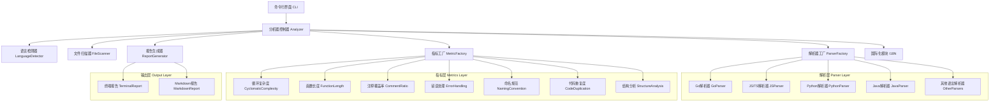

# fuck-u-code 入门指南

> 一款专门揭露屎山代码的质量分析工具，用犀利又搞笑的方式告诉你：**你的代码到底有多烂**


## 📖 项目概览

在代码质量工具层出不穷的今天，为什么 fuck-u-code 能脱颖而出？答案很简单：它不仅仅是一个代码分析工具，更是一个专为揭露"屎山代码"而生的犀利质量评估平台。<mcreference link="https://github.com/brianxiadong/github-hot-projects-analysis/tree/main/ai/AiNiee%E5%85%A5%E9%97%A8%E6%8C%87%E5%8D%97" index="0">0</mcreference>

### 🌟 核心特色一览

🎯 **多语言支持专家**：深度支持 Go、JavaScript/TypeScript、Python、Java、C/C++、C#、Rust、Kotlin、Lua 等9种主流编程语言  
📊 **屎山指数评分**：独创0-100分评分体系，分数越高代码越烂，让你直观了解代码质量  
🔍 **七维度深度检测**：循环复杂度、函数长度、注释覆盖率、错误处理、命名规范、代码重复度、结构分析  
🎨 **彩色终端报告**：批评也能笑着听，用幽默的方式展示严肃的问题  
📝 **Markdown 输出**：方便 AI 分析与文档集成，支持 CI/CD 流程  
🌍 **国际化支持**：支持中文和英文双语输出，满足不同团队需求  
⚡ **高性能分析**：基于 Go 语言开发，分析速度快，资源占用低

## 🏗️ 架构深度解析

### 系统架构图



### 核心组件详解

#### 1. 模块化架构设计 (Modular Architecture)

fuck-u-code 采用了清晰的模块化架构，各组件职责分明，便于维护和扩展：

```go
// 分析器接口定义
type Analyzer interface {
    Analyze(path string) (*AnalysisResult, error)
    AnalyzeFile(filePath string) (*AnalysisResult, error)
    SetLanguage(lang i18n.Language)
    SetSilent(silent bool)
}
```

**技术亮点：**
- **接口驱动设计**：所有核心组件都基于接口设计，便于测试和扩展
- **依赖注入**：通过工厂模式和依赖注入实现组件解耦
- **可配置性**：支持灵活的配置选项，适应不同使用场景

#### 2. 多语言解析系统 (Multi-Language Parser System)

项目支持9种编程语言的解析，每种语言都有专门的解析器：

```go
// 解析器工厂
func CreateParser(language common.LanguageType) Parser {
    switch language {
    case common.Go:
        return NewGoParser()
    case common.JavaScript:
        return NewJavaScriptParser()
    case common.Python:
        return NewPythonParser()
    // ... 其他语言
    default:
        return NewGenericParser()
    }
}
```

**解析器特性：**
- **AST 解析**：对于 Go 语言使用官方 AST 包进行精确解析
- **正则匹配**：对于其他语言使用优化的正则表达式进行模式匹配
- **统一接口**：所有解析器实现统一的 ParseResult 接口
- **扩展性强**：新增语言支持只需实现 Parser 接口

#### 3. 指标评估引擎 (Metrics Evaluation Engine)

七维度指标评估系统，每个指标都有独立的分析逻辑：

```go
// 指标接口定义
type Metric interface {
    Name() string
    Description() string
    Weight() float64
    Analyze(parseResult parser.ParseResult) MetricResult
    SupportedLanguages() []common.LanguageType
}
```

**评分算法：**
- **加权平均**：各指标按权重计算最终得分
- **动态阈值**：根据语言特性调整评分标准
- **问题定位**：精确定位问题代码位置和行号

#### 4. 国际化系统 (Internationalization System)

支持中英文双语输出，所有文本都通过翻译器处理：

```go
// 翻译器接口
type Translator interface {
    Translate(key string) string
    TranslateWithArgs(key string, args ...interface{}) string
}
```

## 🚀 入门教程

### 安装方式

#### 方法一：Go 安装（推荐）
```bash
go install github.com/Done-0/fuck-u-code/cmd/fuck-u-code@latest
```

#### 方法二：源码构建
```bash
git clone https://github.com/Done-0/fuck-u-code.git
cd fuck-u-code
go build -o fuck-u-code ./cmd/fuck-u-code
```

#### 方法三：Docker 构建
```bash
docker build -t fuck-u-code .
```

### 基本使用

#### 快速开始
```bash
# 分析当前目录
fuck-u-code analyze

# 分析指定项目
fuck-u-code analyze /path/to/your/project

# 简化命令（直接分析）
fuck-u-code /path/to/your/project
```

#### 常用选项

| 选项 | 简写 | 描述 | 示例 |
|------|------|------|------|
| `--verbose` | `-v` | 显示详细报告 | `fuck-u-code analyze -v` |
| `--top N` | `-t` | 显示最烂的前N个文件 | `fuck-u-code analyze -t 5` |
| `--issues N` | `-i` | 每文件显示N个问题 | `fuck-u-code analyze -i 3` |
| `--summary` | `-s` | 只显示总结 | `fuck-u-code analyze -s` |
| `--markdown` | `-m` | 输出Markdown格式 | `fuck-u-code analyze -m` |
| `--lang` | `-l` | 设置输出语言 | `fuck-u-code analyze -l en-US` |
| `--exclude` | `-e` | 排除指定目录 | `fuck-u-code analyze -e "**/test/**"` |

### 高级用法

#### Markdown 输出集成
```bash
# 生成 Markdown 报告
fuck-u-code analyze --markdown > code-quality-report.md

# 英文报告，显示前10个问题文件
fuck-u-code analyze --markdown --lang en-US --top 10 > report.md

# 结合 CI/CD 使用
fuck-u-code analyze --markdown --summary | tee quality-report.md
```

#### Docker 运行
```bash
# 分析本地项目
docker run --rm -v "/path/to/project:/build" fuck-u-code analyze

# 生成报告文件
docker run --rm -v "/path/to/project:/build" -v "/output:/output" \
  fuck-u-code analyze --markdown > /output/report.md
```

#### 自定义排除规则
```bash
# 排除测试文件和第三方库
fuck-u-code analyze \
  --exclude "**/node_modules/**" \
  --exclude "**/vendor/**" \
  --exclude "**/*_test.go" \
  --exclude "**/test/**"
```

## 📊 支持的评分指标详解

### 指标权重分布

| 指标名称 | 权重 | 描述 |
|----------|------|------|
| 循环复杂度 | 25% | 函数控制流复杂度 |
| 函数长度 | 20% | 函数代码行数和复杂度 |
| 注释覆盖率 | 15% | 代码注释比例 |
| 错误处理 | 10% | 异常处理完善程度 |
| 命名规范 | 10% | 变量函数命名质量 |
| 代码重复度 | 15% | 重复代码比例 |
| 结构分析 | 15% | 代码嵌套和组织结构 |

### 1. 循环复杂度 (Cyclomatic Complexity)

**原理说明：**
循环复杂度是衡量程序控制流复杂程度的指标，计算程序中线性无关路径的数量。

**计算方法：**
```
复杂度 = 判断节点数 + 1
```

**评分标准：**
- **1-5**：结构清晰，不绕弯子 ✅
- **6-10**：稍微复杂，还能理解 ⚠️
- **11-15**：开始绕弯，需要注意 ⚠️
- **16+**：函数像迷宫，维护像打副本 ❌

**检测关键字：**
```go
// Go语言示例
keywords := []string{
    "if", "else", "for", "range", "switch", "case", 
    "select", "go", "defer", "&&", "||", "?",
}
```

### 2. 函数长度 (Function Length)

**原理说明：**
长函数通常意味着承担了过多职责，违反了单一职责原则，难以理解和维护。

**评分维度：**
- **函数行数**（50%权重）
- **循环复杂度**（20%权重）  
- **状态管理复杂度**（30%权重，仅Go语言）

**评分标准：**
```go
func (m *FunctionLengthMetric) calculateLengthScore(lineCount int) float64 {
    switch {
    case lineCount <= 20:
        return 0.0  // 优秀
    case lineCount <= 50:
        return 0.3  // 良好
    case lineCount <= 100:
        return 0.6  // 一般
    default:
        return 1.0  // 需要重构
    }
}
```

### 3. 注释覆盖率 (Comment Ratio)

**原理说明：**
适当的注释能提高代码可读性，但过多或过少的注释都不是好事。

**计算公式：**
```
注释覆盖率 = 注释行数 / 总代码行数
```

**评分标准：**
- **15-30%**：注释适中，代码清晰 ✅
- **10-15%** 或 **30-40%**：注释偏少或偏多 ⚠️
- **<10%** 或 **>40%**：注释严重不足或过度注释 ❌

### 4. 错误处理 (Error Handling)

**原理说明：**
良好的错误处理是健壮代码的重要标志，特别是在Go语言中。

**检测内容：**
- 是否有适当的错误检查
- 错误是否被正确传播
- 是否有未处理的异常

**评分逻辑：**
```go
func (m *SimpleMetric) Analyze(parseResult parser.ParseResult) MetricResult {
    // 基于语言特性的错误处理检测
    score := 0.25 // 默认评分
    return MetricResult{
        Score: score,
        Issues: []string{},
        Weight: 0.1,
    }
}
```

### 5. 命名规范 (Naming Convention)

**原理说明：**
良好的命名是自文档化代码的基础，能显著提高代码可读性。

**检测规则：**
- **驼峰命名**：JavaScript/TypeScript、Java、C#
- **下划线命名**：Python、C/C++
- **混合命名**：Go语言（公开/私有）

**问题类型：**
- 名称过短（单字符变量）
- 名称过长（超过50字符）
- 不符合语言规范
- 使用拼音或无意义名称

### 6. 代码重复度 (Code Duplication)

**原理说明：**
重复代码违反了DRY（Don't Repeat Yourself）原则，增加维护成本。

**检测方法：**
- 函数签名相似度分析
- 代码块模式匹配
- 字符串字面量重复检测

**评分标准：**
```go
func calculateDuplicationScore(duplicateRatio float64) float64 {
    return duplicateRatio * 2.0 // 重复度直接影响评分
}
```

### 7. 结构分析 (Structure Analysis)

**原理说明：**
分析代码的组织结构，包括嵌套深度、模块依赖等。

**检测维度：**
- **嵌套深度**：if/for/while等语句的嵌套层数
- **函数调用深度**：函数间的调用关系复杂度
- **模块耦合度**：文件间的依赖关系

## 💻 核心源码实现

### 1. 分析器核心实现

```go
// pkg/analyzer/analyzer.go
type DefaultAnalyzer struct {
    codeAnalyzer *CodeAnalyzer
    translator   i18n.Translator
    silent       bool
}

func (a *DefaultAnalyzer) Analyze(path string) (*AnalysisResult, error) {
    info, err := os.Stat(path)
    if err != nil {
        return nil, fmt.Errorf(a.translator.Translate("error.path_not_accessible"), err)
    }

    if info.IsDir() {
        return a.AnalyzeWithExcludes(path, nil, defaultExcludes)
    }

    return a.AnalyzeFile(path)
}
```

### 2. 解析器工厂实现

```go
// pkg/parser/parser.go
func CreateParser(language common.LanguageType) Parser {
    switch language {
    case common.Go:
        return NewGoParser()
    case common.JavaScript:
        return NewJavaScriptParser()
    case common.TypeScript:
        return NewTypeScriptParser()
    case common.Python:
        return NewPythonParser()
    case common.Java:
        return NewJavaParser()
    case common.CPlusPlus, common.C:
        return NewCParser()
    case common.CSharp:
        return NewCSharpParser()
    case common.Rust:
        return NewRustParser()
    case common.Kotlin:
        return NewKotlinParser()
    case common.Lua:
        return NewLuaParser()
    default:
        return NewGenericParser()
    }
}
```

### 3. Go语言AST解析实现

```go
// pkg/parser/go_parser.go
func (p *GoParser) Parse(filePath string, content []byte) (ParseResult, error) {
    fileSet := token.NewFileSet()
    
    // 解析Go源码为AST
    file, err := parser.ParseFile(fileSet, filePath, content, parser.ParseComments)
    if err != nil {
        return nil, fmt.Errorf("failed to parse Go file: %w", err)
    }

    result := &GoParseResult{
        BaseParseResult: BaseParseResult{
            Language: common.Go,
            ASTRoot:  file,
        },
        file:    file,
        fileSet: fileSet,
        content: content,
    }

    // 提取函数信息
    result.extractFunctions()
    result.countLines()

    return result, nil
}
```

### 4. 指标工厂实现

```go
// pkg/metrics/factory.go
func (f *MetricFactory) CreateAllMetrics() []Metric {
    return []Metric{
        f.CreateCyclomaticComplexity(),
        f.CreateFunctionLength(),
        f.CreateCommentRatio(),
        f.CreateErrorHandling(),
        f.CreateNamingConvention(),
        f.CreateCodeDuplication(),
        f.CreateStructureAnalysis(),
    }
}
```

### 5. 循环复杂度计算实现

```go
// pkg/metrics/cyclomatic_complexity.go
func (m *CyclomaticComplexityMetric) calculateComplexity(node ast.Node) int {
    complexity := 1 // 基础复杂度

    ast.Inspect(node, func(n ast.Node) bool {
        switch n.(type) {
        case *ast.IfStmt, *ast.ForStmt, *ast.RangeStmt:
            complexity++
        case *ast.SwitchStmt, *ast.TypeSwitchStmt:
            complexity++
        case *ast.CaseClause:
            if len(n.(*ast.CaseClause).List) > 0 {
                complexity++
            }
        }
        return true
    })

    return complexity
}
```

### 6. 报告生成器实现

```go
// pkg/report/report.go
func (g *ReportGenerator) GenerateReport(result *analyzer.AnalysisResult, options ReportOptions) string {
    if options.MarkdownOutput {
        return g.generateMarkdownReport(result, options)
    }
    return g.generateTerminalReport(result, options)
}

func (g *ReportGenerator) generateMarkdownReport(result *analyzer.AnalysisResult, options ReportOptions) string {
    var report strings.Builder
    
    // 生成报告头部
    report.WriteString("# 代码质量分析报告\n\n")
    
    // 生成总体评分
    score := result.CodeQualityScore * 100
    report.WriteString(fmt.Sprintf("## 总体评分: %.1f/100\n\n", score))
    
    // 生成指标详情表格
    report.WriteString("## 指标详情\n\n")
    report.WriteString("| 指标 | 得分 | 权重 | 状态 |\n")
    report.WriteString("|------|------|------|------|\n")
    
    for name, metric := range result.Metrics {
        status := g.getScoreStatus(metric.Score)
        report.WriteString(fmt.Sprintf("| %s | %.2f | %.1f%% | %s |\n", 
            name, metric.Score*100, metric.Weight*100, status))
    }
    
    return report.String()
}
```

## 🎯 技术亮点和设计理念

### 设计理念

1. **幽默与专业并重**：用轻松幽默的方式传达严肃的代码质量问题
2. **多语言统一**：为不同编程语言提供一致的分析体验
3. **可扩展架构**：模块化设计便于添加新的语言和指标支持
4. **开发者友好**：提供清晰的问题定位和改进建议

### 技术亮点

#### 1. 高性能文件扫描
```go
// 并发文件扫描，提高大项目分析速度
func FindSourceFiles(rootPath string, includePatterns, excludePatterns []string, 
                    progressCallback func(int)) ([]string, error) {
    var files []string
    var mu sync.Mutex
    
    err := filepath.WalkDir(rootPath, func(path string, d fs.DirEntry, err error) error {
        if err != nil {
            return err
        }
        
        if shouldIncludeFile(path, includePatterns, excludePatterns) {
            mu.Lock()
            files = append(files, path)
            progressCallback(len(files))
            mu.Unlock()
        }
        
        return nil
    })
    
    return files, err
}
```

#### 2. 智能语言检测
```go
// 基于文件扩展名的智能语言检测
func (d *DefaultDetector) DetectLanguage(filePath string) LanguageType {
    ext := strings.ToLower(filepath.Ext(filePath))
    
    switch ext {
    case ".go":
        return Go
    case ".js":
        return JavaScript
    case ".ts", ".tsx":
        return TypeScript
    case ".py":
        return Python
    // ... 支持更多语言
    default:
        return Unsupported
    }
}
```

#### 3. 国际化支持
```go
// 完整的国际化支持
var zhCNTranslations = map[string]string{
    "metric.cyclomatic_complexity": "循环复杂度",
    "metric.function_length":       "函数长度",
    "metric.comment_ratio":         "注释覆盖率",
    // ... 更多翻译
}

var enUSTranslations = map[string]string{
    "metric.cyclomatic_complexity": "Cyclomatic Complexity",
    "metric.function_length":       "Function Length",
    "metric.comment_ratio":         "Comment Ratio",
    // ... 更多翻译
}
```

### 性能优化策略

1. **并发处理**：文件扫描和分析过程采用并发处理，提高大项目分析速度
2. **内存优化**：流式处理大文件，避免内存溢出
3. **智能缓存**：缓存解析结果，避免重复计算
4. **增量分析**：支持只分析修改过的文件（规划中）

## 🔧 扩展开发

### 添加新语言支持

1. **实现Parser接口**：
```go
type NewLanguageParser struct {
    // 解析器实现
}

func (p *NewLanguageParser) Parse(filePath string, content []byte) (ParseResult, error) {
    // 实现解析逻辑
}
```

2. **注册到工厂**：
```go
func CreateParser(language common.LanguageType) Parser {
    switch language {
    // ... 现有语言
    case common.NewLanguage:
        return NewNewLanguageParser()
    }
}
```

### 添加新指标

1. **实现Metric接口**：
```go
type CustomMetric struct {
    *BaseMetric
}

func (m *CustomMetric) Analyze(parseResult parser.ParseResult) MetricResult {
    // 实现分析逻辑
    return MetricResult{
        Score:       score,
        Issues:      issues,
        Description: m.Description(),
        Weight:      m.Weight(),
    }
}
```

2. **注册到工厂**：
```go
func (f *MetricFactory) CreateAllMetrics() []Metric {
    return []Metric{
        // ... 现有指标
        f.CreateCustomMetric(),
    }
}
```

## 📈 未来规划

- [ ] **Web界面**：提供基于Web的分析界面
- [ ] **IDE插件**：支持VSCode、GoLand等主流IDE
- [ ] **CI/CD集成**：提供GitHub Actions、GitLab CI等集成方案
- [ ] **历史趋势**：跟踪代码质量变化趋势
- [ ] **团队协作**：支持团队代码质量管理
- [ ] **自定义规则**：允许用户定义自己的质量规则
- [ ] **性能基准**：提供行业代码质量基准对比

## 🤝 贡献指南

欢迎提交 PR 来改进 fuck-u-code！请确保：

1. 代码符合 Go 语言规范
2. 添加适当的测试用例
3. 更新相关文档
4. 保持项目的幽默风格

## 📄 许可证

本项目采用 MIT 许可证，详见 [LICENSE](LICENSE) 文件。

---

> 记住：好的代码是写给人看的，顺便能在机器上运行。而烂代码...就让 fuck-u-code 来告诉你有多烂吧！ 🚀