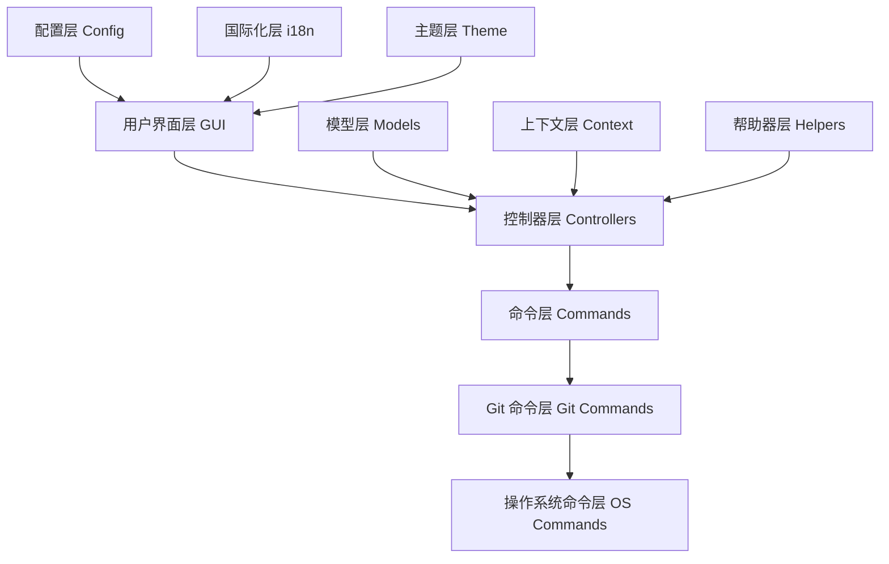
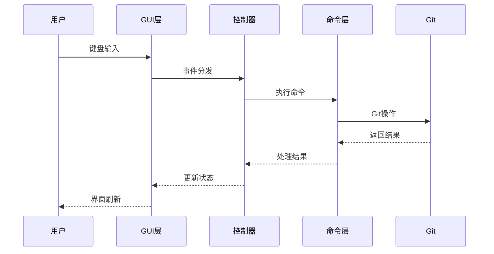

# Lazygit 入门指南

## 概述

Lazygit 是一个简单易用的 Git 终端用户界面（TUI），专为简化 Git 操作而设计。它基于 Go 语言开发，提供了直观的可视化界面来管理 Git 仓库，让复杂的 Git 操作变得简单高效。<mcreference link="https://github.com/brianxiadong/github-hot-projects-analysis/tree/main/ai/FireRedTTS2%E5%85%A5%E9%97%A8%E6%8C%87%E5%8D%97" index="0">0</mcreference>

### 主要特性

- **直观的用户界面**：提供清晰的可视化界面，支持文件暂存、提交、分支管理等操作
- **交互式变基**：简化复杂的 Git rebase 操作，支持 squash、fixup、drop 等功能
- **Cherry-pick 支持**：轻松复制和应用提交到不同分支
- **分支管理**：可视化分支操作，支持创建、删除、合并分支
- **文件差异查看**：内置差异查看器，支持逐行暂存
- **多语言支持**：支持多种语言界面
- **高度可配置**：支持自定义快捷键、主题和命令
- **跨平台支持**：支持 Linux、macOS、Windows

### 技术亮点

- **Go 语言开发**：高性能、跨平台的现代编程语言
- **Gocui 框架**：基于终端的用户界面框架，提供丰富的交互体验
- **模块化架构**：清晰的代码结构，便于维护和扩展
- **Git 原生集成**：直接调用 Git 命令，确保与 Git 的完全兼容性

## 架构设计

### 整体架构

Lazygit 采用分层架构设计，主要包含以下几个核心层次：



### 核心组件

#### 1. 应用程序层 (pkg/app)
- **职责**：应用程序启动、初始化、错误处理
- **核心文件**：`app.go`、`entry_point.go`
- **功能**：
  - 应用程序生命周期管理
  - 依赖注入和初始化
  - 全局错误处理
  - 配置加载和验证

#### 2. 用户界面层 (pkg/gui)
- **职责**：用户界面渲染、事件处理、布局管理
- **核心文件**：`gui.go`、`layout.go`、`views.go`
- **功能**：
  - 窗口和视图管理
  - 键盘事件处理
  - 界面布局和渲染
  - 状态管理

#### 3. 控制器层 (pkg/gui/controllers)
- **职责**：业务逻辑处理、用户操作响应
- **核心组件**：
  - `BranchController`：分支操作控制器
  - `CommitController`：提交操作控制器
  - `FileController`：文件操作控制器
  - `RebaseController`：变基操作控制器

#### 4. 命令层 (pkg/commands)
- **职责**：Git 命令封装、操作系统命令执行
- **核心文件**：`git.go`、各种 git_commands
- **功能**：
  - Git 命令的高级封装
  - 命令执行和结果处理
  - 错误处理和重试机制

#### 5. 上下文层 (pkg/gui/context)
- **职责**：视图状态管理、焦点控制
- **功能**：
  - 视图状态维护
  - 键盘焦点管理
  - 上下文切换

### 数据流架构



## 入门操作

### 环境要求

#### 操作系统
- **Linux**：支持大多数现代 Linux 发行版
- **macOS**：macOS 10.12 或更高版本
- **Windows**：Windows 10 或更高版本

#### 软件依赖
- **Git**：版本 2.32.0 或更高版本（必需）
- **Go**：版本 1.24.0 或更高版本（仅开发时需要）
- **终端**：支持 256 色的现代终端

#### 推荐配置
- **字体**：Nerd Fonts（用于图标显示）
- **终端**：支持真彩色的终端（如 iTerm2、Windows Terminal）

### 快速安装

#### 方法一：二进制发布版（推荐）

**macOS (Homebrew)**
```bash
# 安装 lazygit
brew install lazygit

# 验证安装
lazygit --version
```

**Linux (各发行版)**
```bash
# Ubuntu/Debian
sudo apt install lazygit

# Arch Linux
sudo pacman -S lazygit

# Fedora
sudo dnf install lazygit

# 或使用 snap
sudo snap install lazygit
```

**Windows**
```powershell
# 使用 Scoop
scoop install lazygit

# 使用 Chocolatey
choco install lazygit

# 使用 Winget
winget install JesseDuffield.lazygit
```

#### 方法二：从源码编译

```bash
# 克隆项目
git clone https://github.com/jesseduffield/lazygit.git
cd lazygit

# 编译安装
go install

# 或者构建二进制文件
make build
```

#### 方法三：Docker 安装

```bash
# 拉取镜像
docker pull lazyteam/lazygit

# 运行容器
docker run -it --rm -v $(pwd):/app -w /app lazyteam/lazygit
```

### 验证安装

运行以下命令验证安装是否成功：

```bash
lazygit --version
```

如果安装成功，将显示版本信息。

### 基本使用

#### 启动 Lazygit

在任何 Git 仓库目录中运行：

```bash
lazygit
```

#### 界面布局说明

Lazygit 的界面分为几个主要区域：

1. **状态面板**（左上）：显示当前分支、仓库状态
2. **文件面板**（左中）：显示工作区文件变更
3. **分支面板**（左下）：显示本地和远程分支
4. **主面板**（右侧）：显示详细信息（差异、日志等）
5. **命令面板**（底部）：显示可用命令和快捷键

#### 基本操作流程

**1. 文件暂存和提交**
```
1. 使用 ↑↓ 键在文件列表中导航
2. 按 Space 键暂存/取消暂存文件
3. 按 Enter 查看文件差异
4. 按 c 键创建提交
5. 输入提交信息并保存
```

**2. 分支操作**
```
1. 按 Tab 切换到分支面板
2. 使用 ↑↓ 键选择分支
3. 按 Space 键切换分支
4. 按 n 键创建新分支
5. 按 d 键删除分支
```

**3. 查看提交历史**
```
1. 按 Tab 切换到提交面板
2. 使用 ↑↓ 键浏览提交
3. 按 Enter 查看提交详情
4. 按 d 查看提交差异
```

#### 常用快捷键

| 快捷键 | 功能 |
|--------|------|
| `?` | 显示帮助 |
| `Tab` | 切换面板 |
| `↑↓` | 导航 |
| `Space` | 暂存/取消暂存 |
| `Enter` | 查看详情 |
| `c` | 提交 |
| `P` | 推送 |
| `p` | 拉取 |
| `R` | 刷新 |
| `q` | 退出 |

## 高级功能

### 交互式变基 (Interactive Rebase)

交互式变基是 Lazygit 的核心功能之一，让复杂的 Git rebase 操作变得简单直观。

#### 启动交互式变基

1. 在提交面板中选择要变基的起始提交
2. 按 `i` 键启动交互式变基
3. 使用以下操作：
   - `s`：压缩提交 (squash)
   - `f`：修正提交 (fixup)
   - `d`：删除提交 (drop)
   - `e`：编辑提交 (edit)
   - `Ctrl+k/j`：移动提交位置

#### 变基操作示例

```bash
# 场景：合并最近3个提交
1. 选择第4个提交（从上往下数）
2. 按 i 启动变基
3. 对要合并的提交按 s 键
4. 按 m 打开变基菜单
5. 选择 "continue" 继续变基
```

### Cherry-pick 操作

Cherry-pick 允许你将特定提交应用到当前分支。

#### 基本 Cherry-pick

1. 在提交面板中选择要复制的提交
2. 按 `Shift+c` 复制提交
3. 切换到目标分支
4. 按 `Shift+v` 粘贴（应用）提交

#### 批量 Cherry-pick

1. 使用 `Shift+↑↓` 选择多个提交
2. 按 `Shift+c` 复制选中的提交
3. 切换到目标分支
4. 按 `Shift+v` 应用所有提交

### 文件差异和暂存

#### 逐行暂存

1. 在文件面板中选择文件
2. 按 `Enter` 进入差异视图
3. 使用 `↑↓` 导航到具体行
4. 按 `Space` 暂存单行
5. 按 `v` 开始选择范围
6. 按 `a` 暂存整个 hunk

#### 部分文件暂存

```bash
# 暂存文件的部分更改
1. 选择修改的文件
2. 按 Enter 查看差异
3. 导航到要暂存的行
4. 按 Space 暂存选中行
5. 按 v 选择范围暂存
```

### 分支管理

#### 高级分支操作

**创建和切换分支**
```bash
1. 在分支面板按 n 创建新分支
2. 输入分支名称
3. 按 Space 切换到分支
4. 按 o 从远程检出分支
```

**分支合并**
```bash
1. 切换到目标分支
2. 在分支面板选择要合并的分支
3. 按 M 选择合并方式：
   - Fast-forward merge
   - Create merge commit
   - Squash merge
```

**分支删除**
```bash
1. 选择要删除的分支
2. 按 d 删除本地分支
3. 按 D 强制删除分支
```

### 工作树 (Worktrees)

Worktrees 允许你同时在多个分支上工作。

#### 创建工作树

1. 按 `Tab` 切换到工作树面板
2. 按 `n` 创建新工作树
3. 选择分支和目录
4. 按 `Enter` 确认创建

#### 管理工作树

```bash
# 切换工作树
1. 在工作树面板选择目标工作树
2. 按 Enter 切换

# 删除工作树
1. 选择要删除的工作树
2. 按 d 删除
```

### 自定义命令

Lazygit 支持自定义命令来扩展功能。

#### 配置自定义命令

在配置文件中添加：

```yaml
customCommands:
  - key: 'ctrl+g'
    command: 'git log --oneline -10'
    description: '显示最近10个提交'
    context: 'global'
  - key: 'ctrl+p'
    command: 'git push origin {{.CheckedOutBranch.Name}}'
    description: '推送当前分支'
    context: 'localBranches'
```

### 搜索和过滤

#### 文件搜索

1. 在任何面板按 `/` 开始搜索
2. 输入搜索关键词
3. 按 `Enter` 确认搜索
4. 使用 `n/N` 导航搜索结果

#### 提交过滤

```bash
# 按作者过滤
1. 在提交面板按 /
2. 输入 "author:用户名"

# 按消息过滤
1. 按 /
2. 输入关键词

# 按日期过滤
1. 按 /
2. 输入 "since:2024-01-01"
```

## 源码分析

### 项目结构详解

```
lazygit/
├── cmd/                    # 命令行工具
│   ├── i18n/              # 国际化工具
│   └── integration_test/   # 集成测试工具
├── pkg/                    # 核心包
│   ├── app/               # 应用程序层
│   ├── commands/          # 命令层
│   ├── config/            # 配置管理
│   ├── gui/               # 用户界面
│   ├── i18n/              # 国际化
│   └── utils/             # 工具函数
├── docs/                   # 文档
├── test/                   # 测试文件
└── vendor/                 # 第三方依赖
```

### 核心模块分析

#### 1. 应用程序入口 (main.go)

```go
package main

import (
    "github.com/jesseduffield/lazygit/pkg/app"
)

func main() {
    ldFlagsBuildInfo := &app.BuildInfo{
        Commit:      commit,
        Date:        date,
        Version:     version,
        BuildSource: buildSource,
    }
    
    app.Start(ldFlagsBuildInfo, nil)
}
```

**关键点**：
- 简洁的入口点设计
- 构建信息注入
- 委托给 app 包处理启动逻辑

#### 2. 应用程序层 (pkg/app/app.go)

```go
type App struct {
    *common.Common
    closers   []io.Closer
    Config    config.AppConfigurer
    OSCommand *oscommands.OSCommand
    Gui       *gui.Gui
}

func NewApp(config config.AppConfigurer, test integrationTypes.IntegrationTest, common *common.Common) (*App, error) {
    app := &App{
        closers: []io.Closer{},
        Config:  config,
        Common:  common,
    }
    
    // 初始化 OS 命令
    app.OSCommand = oscommands.NewOSCommand(common, config, oscommands.GetPlatform(), oscommands.NewNullGuiIO(app.Log))
    
    // 验证 Git 版本
    gitVersion, err := app.validateGitVersion()
    if err != nil {
        return app, err
    }
    
    // 初始化 GUI
    app.Gui, err = gui.NewGui(common, config, gitVersion, updater, showRecentRepos, dirName, test)
    if err != nil {
        return app, err
    }
    
    return app, nil
}
```

**设计模式**：
- **依赖注入**：通过构造函数注入依赖
- **工厂模式**：NewApp 作为工厂函数
- **组合模式**：App 组合多个子系统

#### 3. GUI 层架构 (pkg/gui/gui.go)

```go
type Gui struct {
    *common.Common
    g          *gocui.Gui           // 底层 GUI 框架
    gitVersion *git_commands.GitVersion
    git        *commands.GitCommand  // Git 命令接口
    os         *oscommands.OSCommand // OS 命令接口
    
    State *GuiRepoState            // GUI 状态
    Views types.Views              // 视图集合
    
    // 各种管理器
    statusManager        *status.StatusManager
    viewBufferManagerMap map[string]*tasks.ViewBufferManager
    PopupHandler         types.IPopupHandler
    
    // 辅助组件
    c       *helpers.HelperCommon
    helpers *helpers.Helpers
}
```

**架构特点**：
- **分层设计**：GUI -> Commands -> Git
- **状态管理**：集中的状态管理
- **事件驱动**：基于 gocui 的事件循环

#### 4. 命令层设计 (pkg/commands/git.go)

```go
type GitCommand struct {
    Blame       *git_commands.BlameCommands
    Branch      *git_commands.BranchCommands
    Commit      *git_commands.CommitCommands
    Config      *git_commands.ConfigCommands
    // ... 更多命令模块
}

func NewGitCommand(cmn *common.Common, version *GitVersion, osCommand *oscommands.OSCommand, gitConfig git_config.IGitConfig, syncMutex *sync.Mutex) (*GitCommand, error) {
    // 创建通用 Git 命令对象
    gitCommon := git_commands.NewGitCommon(cmn, version, osCommand, gitConfig, syncMutex)
    
    // 初始化各个命令模块
    fileLoader := git_commands.NewFileLoader(gitCommon, cmn.Log)
    statusCommands := git_commands.NewStatusCommands(gitCommon, fileLoader)
    // ...
    
    return &GitCommand{
        Branch: branchCommands,
        Commit: commitCommands,
        // ...
    }, nil
}
```

**设计原则**：
- **单一职责**：每个命令模块负责特定功能
- **依赖注入**：通过构造函数注入依赖
- **接口隔离**：定义清晰的接口边界

#### 5. 控制器模式 (pkg/gui/controllers)

```go
type BranchController struct {
    c *helpers.HelperCommon
}

func (self *BranchController) GetKeybindings(opts types.KeybindingsOpts) []*types.Binding {
    return []*types.Binding{
        {
            Key:         opts.GetKey(opts.Config.Branches.CreatePullRequest),
            Handler:     self.handleCreatePullRequest,
            Description: self.c.Tr.CreatePullRequest,
        },
        {
            Key:         opts.GetKey(opts.Config.Branches.CheckoutBranchByName),
            Handler:     self.checkoutByName,
            Description: self.c.Tr.CheckoutByName,
        },
        // ...
    }
}

func (self *BranchController) handleCreatePullRequest() error {
    branch := self.c.Contexts().Branches.GetSelected()
    if branch == nil {
        return nil
    }
    
    return self.c.Helpers().Host.CreatePullRequest(branch.Name)
}
```

**控制器特点**：
- **命令模式**：键绑定到处理函数
- **策略模式**：不同操作的不同策略
- **责任链模式**：事件处理链

### 关键设计模式

#### 1. MVC 架构

```
Model (pkg/commands/models)     # 数据模型
  ↓
View (pkg/gui/views)           # 视图层
  ↓  
Controller (pkg/gui/controllers) # 控制器
```

#### 2. 观察者模式

```go
// 状态变更通知
type StateAccessor struct {
    gui *Gui
}

func (self *StateAccessor) SetUpdating(value bool) {
    self.gui.Updating = value
    // 触发界面更新
    self.gui.render()
}
```

#### 3. 策略模式

```go
// 不同的合并策略
type MergeStrategy interface {
    Merge(branch string) error
}

type FastForwardMerge struct{}
type CreateMergeCommit struct{}
type SquashMerge struct{}
```

#### 4. 工厂模式

```go
// 命令工厂
func NewGitCommand(...) *GitCommand {
    return &GitCommand{
        Branch: git_commands.NewBranchCommands(...),
        Commit: git_commands.NewCommitCommands(...),
        // ...
    }
}
```

### 性能优化技术

#### 1. 异步处理

```go
// 异步执行 Git 命令
func (self *Gui) runAsyncCommand(cmd string) {
    self.OnWorker(func() {
        output, err := self.git.Custom.RunCommand(cmd)
        
        self.OnUIThread(func() {
            if err != nil {
                self.createErrorPanel(err.Error())
            } else {
                self.refreshSidePanels(refreshOptions{})
            }
        })
    })
}
```

#### 2. 缓存机制

```go
// 文件状态缓存
type FileLoader struct {
    cache map[string]*models.File
    mutex sync.RWMutex
}

func (self *FileLoader) GetStatusFiles() []*models.File {
    self.mutex.RLock()
    defer self.mutex.RUnlock()
    
    if cached, exists := self.cache["status"]; exists {
        return cached
    }
    
    // 加载文件状态
    files := self.loadFiles()
    self.cache["status"] = files
    return files
}
```

#### 3. 内存管理

```go
// 视图缓冲区管理
type ViewBufferManager struct {
    buffer []string
    maxSize int
}

func (self *ViewBufferManager) AddLine(line string) {
    self.buffer = append(self.buffer, line)
    
    // 限制缓冲区大小
    if len(self.buffer) > self.maxSize {
        self.buffer = self.buffer[1:]
    }
}
```

### 测试架构

#### 1. 单元测试

```go
func TestBranchController_HandleCreatePullRequest(t *testing.T) {
    scenarios := []struct {
        name           string
        selectedBranch *models.Branch
        expectedError  string
    }{
        {
            name:           "successful pull request creation",
            selectedBranch: &models.Branch{Name: "feature-branch"},
            expectedError:  "",
        },
    }
    
    for _, scenario := range scenarios {
        t.Run(scenario.name, func(t *testing.T) {
            // 测试逻辑
        })
    }
}
```

#### 2. 集成测试

```go
// 集成测试框架
func TestInteractiveRebase(t *testing.T) {
    test := NewIntegrationTest(NewIntegrationTestArgs{
        Description:  "Interactive rebase",
        ExtraCmdArgs: []string{},
        Skip:         false,
    })
    
    test.Run(func(shell *Shell, input *Input, assert *Assert, keys config.KeybindingConfig) {
        // 设置测试环境
        shell.CreateFile("file1.txt", "content1")
        shell.RunCommand("git add file1.txt")
        shell.RunCommand("git commit -m 'commit 1'")
        
        // 执行测试操作
        input.PressKey(keys.Commits.StartInteractiveRebase)
        
        // 验证结果
        assert.InListContext()
        assert.SelectedLine(Contains("commit 1"))
    })
}
```

### 扩展性设计

#### 1. 插件系统

```go
// 自定义命令插件接口
type CustomCommand interface {
    GetKey() string
    GetDescription() string
    Execute(context Context) error
}

// 插件注册
func RegisterCustomCommand(cmd CustomCommand) {
    customCommands[cmd.GetKey()] = cmd
}
```

#### 2. 主题系统

```go
// 主题接口
type Theme interface {
    GetStyle(element string) Style
    GetColor(name string) Color
}

// 主题实现
type DefaultTheme struct{}

func (t *DefaultTheme) GetStyle(element string) Style {
    switch element {
    case "selectedLine":
        return Style{Fg: ColorBlue, Bg: ColorDefault}
    default:
        return Style{Fg: ColorDefault, Bg: ColorDefault}
    }
}
```

### 总结

Lazygit 的源码展现了优秀的软件工程实践：

1. **清晰的架构分层**：从 GUI 到命令层的清晰分离
2. **丰富的设计模式**：MVC、观察者、策略等模式的合理运用
3. **高度的可扩展性**：插件系统和主题系统支持
4. **完善的测试体系**：单元测试和集成测试并重
5. **优秀的性能优化**：异步处理、缓存机制等

这些设计使得 Lazygit 不仅功能强大，而且易于维护和扩展，为开发者提供了优秀的 Git 用户体验。