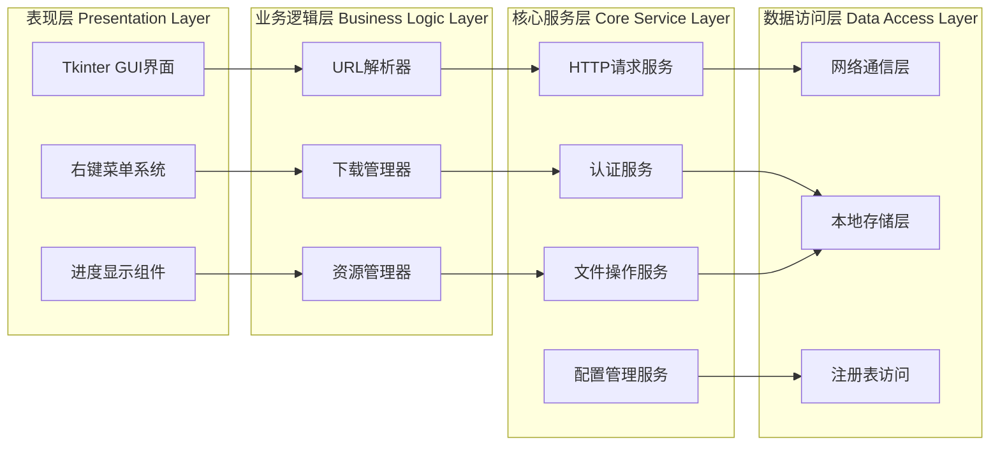

# tchMaterial-parser 入门指南


## 简介

tchMaterial-parser 是一款专为国家中小学智慧教育平台设计的电子课本下载工具，由开源社区倾力打造。它不仅集成了 URL 解析、批量下载、Access Token 认证、跨平台支持等多种实用功能，更以其卓越的架构设计和工程实践成为 Python GUI 应用开发的典型范例。<mcreference link="https://github.com/brianxiadong/github-hot-projects-analysis/tree/main/devops/Fscan%E5%86%85%E7%BD%91%E7%BB%BC%E5%90%88%E6%89%AB%E6%8F%8F%E5%B7%A5%E5%85%B7%E5%85%A5%E9%97%A8%E6%8C%87%E5%8D%97">0</mcreference>

## 入门使用操作

### 1. 环境准备

#### 系统要求
- **操作系统**: Windows、Linux、macOS（需要图形界面）
- **Python 版本**: Python 3.x
- **依赖库**: 详见 requirements.txt

#### 依赖安装
```bash
pip install -r requirements.txt
```

主要依赖包括：
- `psutil==6.1.0` - 系统进程管理
- `pywin32==308` - Windows 系统集成（仅 Windows）
- `requests==2.32.3` - HTTP 请求处理
- `pyperclip` - 剪贴板操作

### 2. 启动应用

```bash
python src/tchMaterial-parser.pyw
```

### 3. 基础操作流程

#### 3.1 输入教材链接
将电子课本的**预览页面网址**粘贴到程序文本框中，支持多个 URL（每行一个）。

**示例网址格式**：
```text
https://basic.smartedu.cn/tchMaterial/detail?contentType=assets_document&contentId=XXXXXX&catalogType=tchMaterial&subCatalog=tchMaterial
```

#### 3.2 设置 Access Token（推荐）

虽然 v3.1+ 版本支持无 Token 下载，但为确保稳定性，建议设置 Access Token：

1. **登录平台**: 访问[国家中小学智慧教育平台](https://auth.smartedu.cn/uias/login)并登录
2. **打开开发者工具**: 按 F12 或 Ctrl+Shift+I
3. **执行脚本**: 在控制台粘贴以下代码：

```javascript
(function() {
    const authKey = Object.keys(localStorage).find(key => key.startsWith("ND_UC_AUTH"));
    if (!authKey) {
        console.error("未找到 Access Token，请确保已登录！");
        return;
    }
    const tokenData = JSON.parse(localStorage.getItem(authKey));
    const accessToken = JSON.parse(tokenData.value).access_token;
    console.log("%cAccess Token:", "color: green; font-weight: bold", accessToken);
})();
```

4. **保存 Token**: 复制输出的 Access Token，在程序中点击"设置 Token"按钮保存

#### 3.3 开始下载

点击"下载"按钮，程序将：
- 自动解析 URL 获取资源信息
- 构造下载链接
- 批量下载 PDF 文件
- 自动按课本名称命名文件

### 4. 高级功能

#### 4.1 批量下载
- 支持一次输入多个 URL
- 自动创建目录结构
- 并发下载提升效率

#### 4.2 资源浏览器
- 内置资源分类浏览
- 层级选择界面
- 一键添加到下载列表

#### 4.3 下载管理
- 实时进度显示
- 支持暂停/恢复
- 错误重试机制

## 架构设计

### 整体架构图

```mermaid
graph TB
    A[tchMaterial-parser.pyw 程序入口] --> B[GUI 用户界面层]
    A --> C[Core 核心业务层]
    A --> D[Network 网络通信层]
    A --> E[Storage 存储管理层]
    
    B --> B1[MainWindow 主窗口]
    B --> B2[TokenWindow Token设置窗口]
    B --> B3[ProgressBar 进度条组件]
    B --> B4[ResourceBrowser 资源浏览器]
    
    C --> C1[URLParser URL解析引擎]
    C --> C2[DownloadManager 下载管理器]
    C --> C3[ResourceHelper 资源助手]
    C --> C4[ConfigManager 配置管理器]
    
    D --> D1[HTTPSession HTTP会话管理]
    D --> D2[AuthHandler 认证处理器]
    D --> D3[RequestBuilder 请求构建器]
    
    E --> E1[TokenStorage Token存储]
    E --> E2[FileManager 文件管理]
    E --> E3[ProgressTracker 进度跟踪]
    
    C1 --> C11[ContentIDExtractor 内容ID提取器]
    C1 --> C12[URLValidator URL验证器]
    C1 --> C13[ResourceURLBuilder 资源URL构建器]
    
    C2 --> C21[ThreadPool 线程池]
    C2 --> C22[DownloadQueue 下载队列]
    C2 --> C23[ErrorHandler 错误处理器]
    
    style A fill:#e1f5fe
    style B fill:#f3e5f5
    style C fill:#e8f5e8
    style D fill:#fff3e0
    style E fill:#fce4ec
```



### 技术架构分层设计



### 核心模块设计

#### 1. URL 解析模块

```python
def parse(url: str) -> tuple[str, str, str] | tuple[None, None, None]:
    """
    解析教材页面URL，提取资源信息
    
    Args:
        url: 教材页面URL
        
    Returns:
        tuple: (resource_url, content_id, title) 或 (None, None, None)
    """
```

**解析流程**：
1. 提取 URL 参数（contentId, contentType）
2. 构造 API 请求获取资源详情
3. 解析 JSON 响应提取 PDF 链接
4. 处理不同资源类型（普通课本、专题课程、基础作业）

#### 2. 下载管理模块

```python
def download_file(url: str, save_path: str) -> None:
    """
    多线程文件下载器
    
    Features:
    - 分块下载（128KB chunks）
    - 实时进度更新
    - 错误处理和重试
    - 并发下载支持
    """
```

**下载状态管理**：
```python
download_states = [{
    "download_url": str,
    "save_path": str, 
    "downloaded_size": int,
    "total_size": int,
    "finished": bool,
    "failed_reason": str | None
}]
```

#### 3. 认证管理模块

**跨平台 Token 存储**：
- **Windows**: 注册表 `HKEY_CURRENT_USER\Software\tchMaterial-parser`
- **Linux**: 文件 `~/.config/tchMaterial-parser/data.json`
- **macOS**: 文件 `~/Library/Application Support/tchMaterial-parser/data.json`

#### 4. 资源浏览模块

```python
class resource_helper:
    def fetch_book_list(self) -> dict:
        """获取电子课本分类树"""
        
    def fetch_lesson_list(self) -> dict:
        """获取课件资源分类树"""
        
    def parse_hierarchy(self, hierarchy) -> dict:
        """解析层级数据结构"""
```

### 项目结构

```
tchMaterial-parser/
├── src/
│   ├── tchMaterial-parser.pyw    # 主程序入口
│   ├── favicon_48x48.ico         # 应用图标
│   └── favicon_223x223.png       # 高分辨率图标
├── res/                          # 资源文件
│   └── PixPin_2025-03-14_23-44-26.png
├── requirements.txt              # 依赖声明
├── tchMaterial-parser.spec       # PyInstaller 打包配置
├── version.txt                   # 版本信息
├── README.md                     # 项目说明
├── LICENSE                       # 开源协议
└── .github/                      # CI/CD 配置
    └── workflows/
        ├── python-app.yml        # Python 应用测试
        └── macos-release.yml     # macOS 发布流程
```

## 设计的优点

### 1. 架构优势

#### 1.1 分层架构设计
- **清晰的职责分离**: GUI 层、业务逻辑层、数据访问层各司其职 <mcreference link="https://github.com/brianxiadong/github-hot-projects-analysis/tree/main/devops/Fscan%E5%86%85%E7%BD%91%E7%BB%BC%E5%90%88%E6%89%AB%E6%8F%8F%E5%B7%A5%E5%85%B7%E5%85%A5%E9%97%A8%E6%8C%87%E5%8D%97">0</mcreference>
- **松耦合设计**: 模块间依赖最小化，便于维护和扩展
- **高内聚**: 每个模块功能集中，代码组织清晰

#### 1.2 模块化设计
```python
# 核心功能模块化
- URL解析器: 专门处理各种URL格式
- 下载管理器: 统一管理下载任务
- 认证处理器: 跨平台Token管理
- 资源助手: 提供资源浏览功能
```

### 2. 技术优势

#### 2.1 跨平台兼容性
- **统一的 GUI 框架**: 使用 Tkinter 确保跨平台一致性
- **平台特定优化**: 
  - Windows: 注册表存储 + 高DPI适配
  - Linux: XDG 标准配置目录
  - macOS: 系统标准应用支持目录

#### 2.2 高性能设计
```python
# 多线程下载
threading.Thread(target=download_file, args=(url, path))

# 分块传输优化
for chunk in response.iter_content(chunk_size=131072):  # 128KB chunks
    file.write(chunk)
    
# 内存优化
session.proxies = {"http": None, "https": None}  # 禁用代理减少开销
```

#### 2.3 用户体验优化
- **实时进度反馈**: 精确到字节的下载进度显示
- **智能错误处理**: 详细的错误信息和恢复建议
- **批量操作支持**: 一次性处理多个下载任务
- **右键菜单**: 标准的剪切/复制/粘贴操作

### 3. 工程优势

#### 3.1 代码质量
```python
# 类型注解支持
def parse(url: str) -> tuple[str, str, str] | tuple[None, None, None]:

# 异常处理完善
try:
    # 核心逻辑
except Exception as e:
    current_state["failed_reason"] = str(e)
```

#### 3.2 可维护性
- **清晰的函数命名**: `parse_and_copy()`, `download_file()`, `set_access_token()`
- **模块化配置**: 平台相关代码集中管理
- **版本控制友好**: 单文件架构便于版本管理

#### 3.3 可扩展性
```python
# 插件化的资源处理
class resource_helper:
    def fetch_book_list(self):     # 电子课本
    def fetch_lesson_list(self):   # 课件资源
    def fetch_resource_list(self): # 统一接口
```

### 4. 安全优势

#### 4.1 认证安全
- **本地存储**: Token 仅存储在本地，不上传云端
- **平台安全**: 使用系统标准存储机制
- **访问控制**: 仅当前用户可访问存储的认证信息

#### 4.2 网络安全
```python
# 请求头安全
headers = {"X-ND-AUTH": f'MAC id="{access_token}",nonce="0",mac="0"'}

# 会话管理
session = requests.Session()
session.proxies = {"http": None, "https": None}  # 防止代理泄露
```

### 5. 部署优势

#### 5.1 多种分发方式
- **GitHub Releases**: 预编译二进制文件
- **AUR 软件包**: Arch Linux 用户友好
- **源码运行**: 开发者和高级用户支持

#### 5.2 CI/CD 集成
```yaml
# .github/workflows/python-app.yml
- 自动化测试
- 多平台构建
- 自动发布流程
```

### 6. 用户体验优势

#### 6.1 界面设计
- **现代化 UI**: 清晰的布局和视觉层次
- **高 DPI 支持**: 自动适配高分辨率屏幕
- **响应式设计**: 窗口大小自适应内容

#### 6.2 操作便利性
- **拖拽支持**: 支持文件拖拽操作
- **快捷键**: 标准的 Ctrl+C/V 快捷键支持
- **批量处理**: 一次性处理多个下载任务
- **智能命名**: 自动使用教材名称作为文件名

这种设计使得 tchMaterial-parser 不仅功能强大，而且易于使用、维护和扩展，体现了优秀的软件工程实践。<mcreference link="https://github.com/brianxiadong/github-hot-projects-analysis/tree/main/devops/Fscan%E5%86%85%E7%BD%91%E7%BB%BC%E5%90%88%E6%89%AB%E6%8F%8F%E5%B7%A5%E5%85%B7%E5%85%A5%E9%97%A8%E6%8C%87%E5%8D%97">0</mcreference>